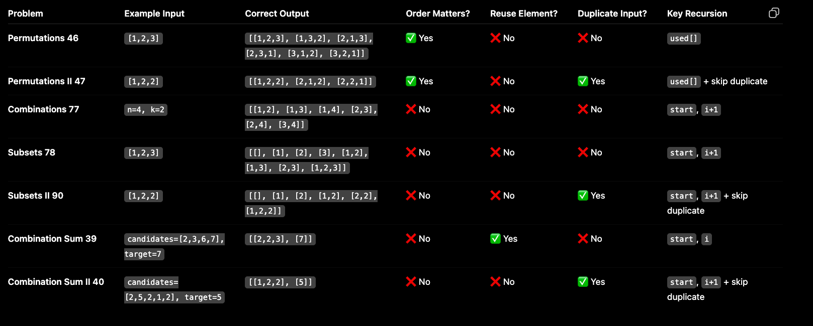
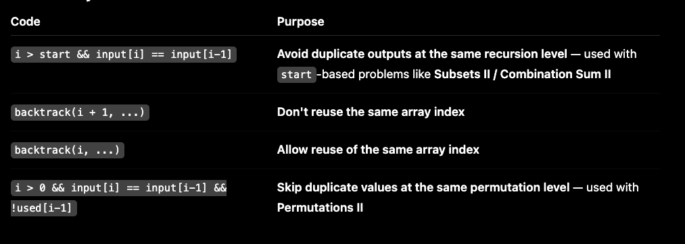
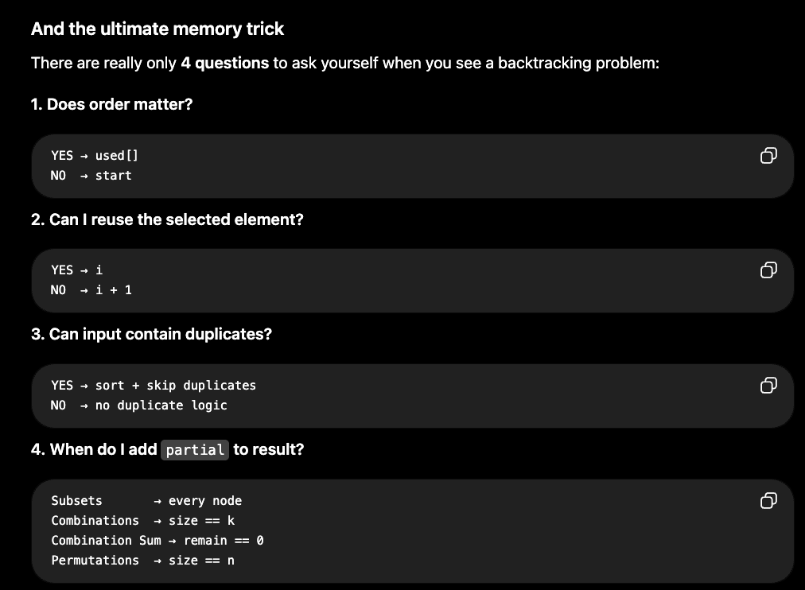
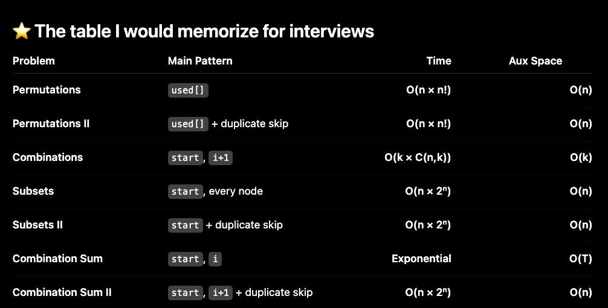
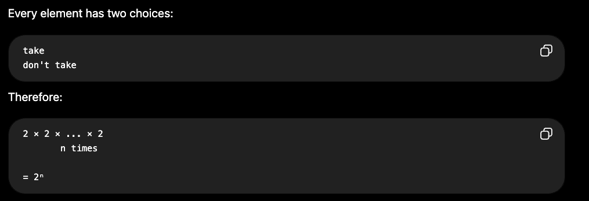

## Permutation Order Matters - [1,2] ≠ [2,1]
## Combination Order Doesn't Matter - [1,2] = [2,1]

### Wherever you are removing duplicates sort array

For permutation - n for copy into result, and n! for permutations

For Time = O(n × 2ⁿ)
- n for copy into result
- 2ⁿ
