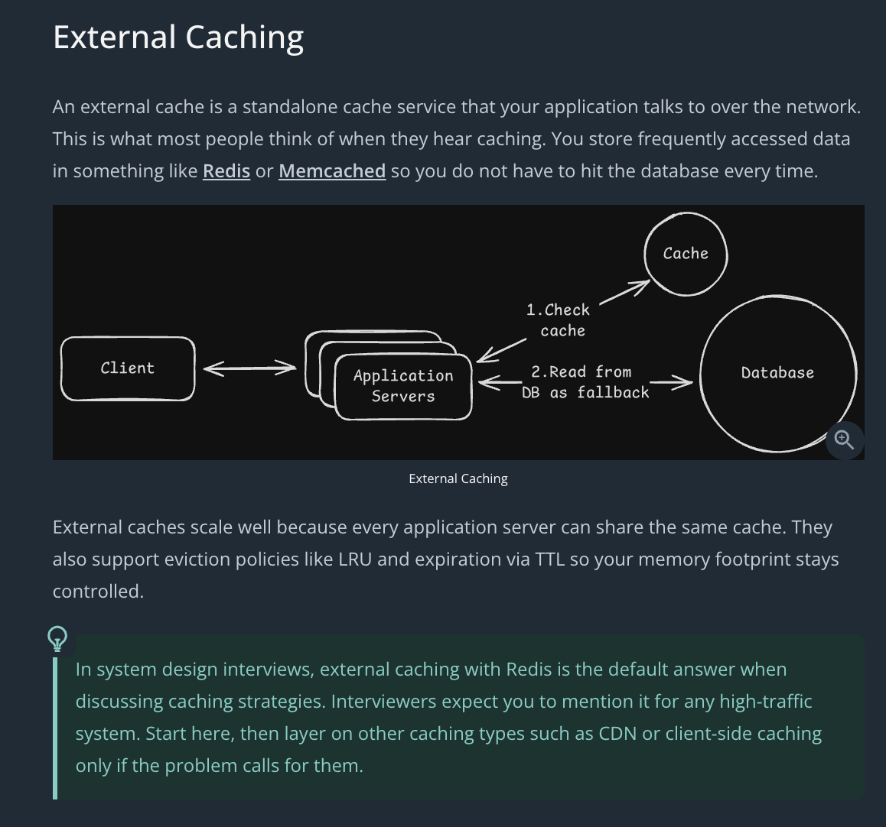
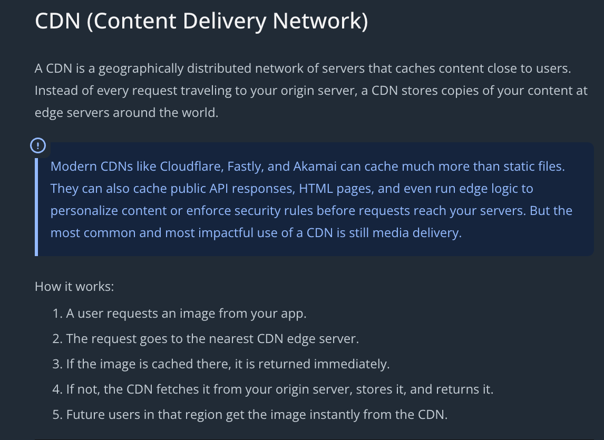
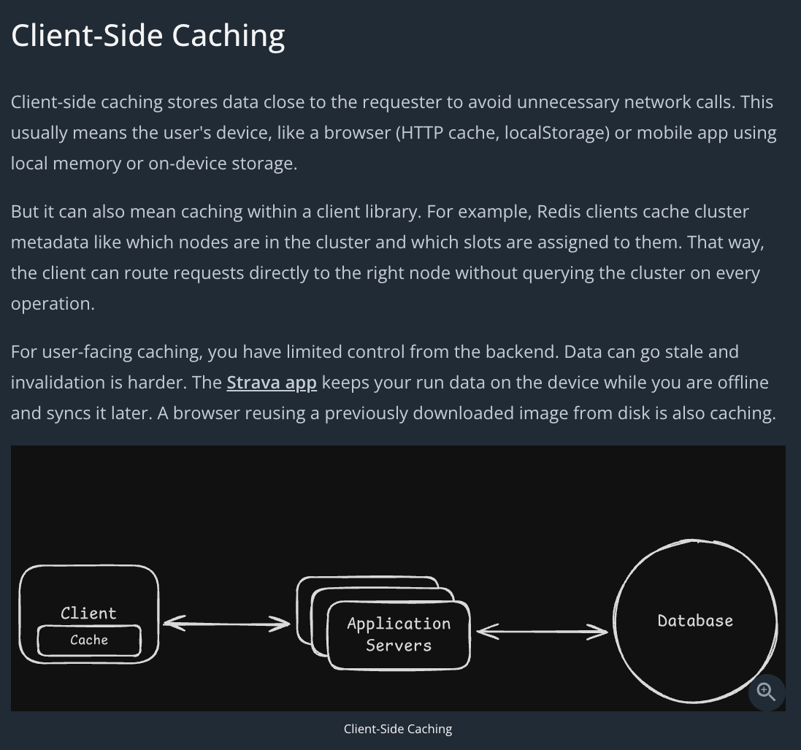
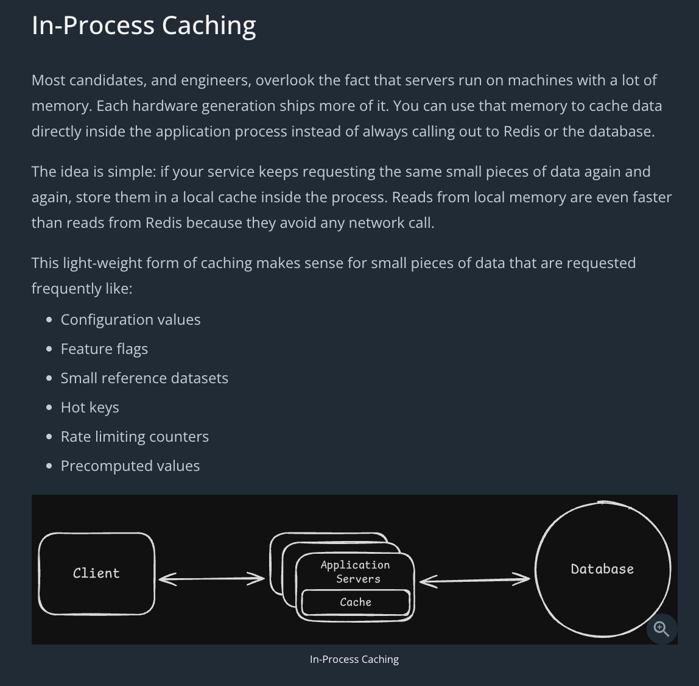
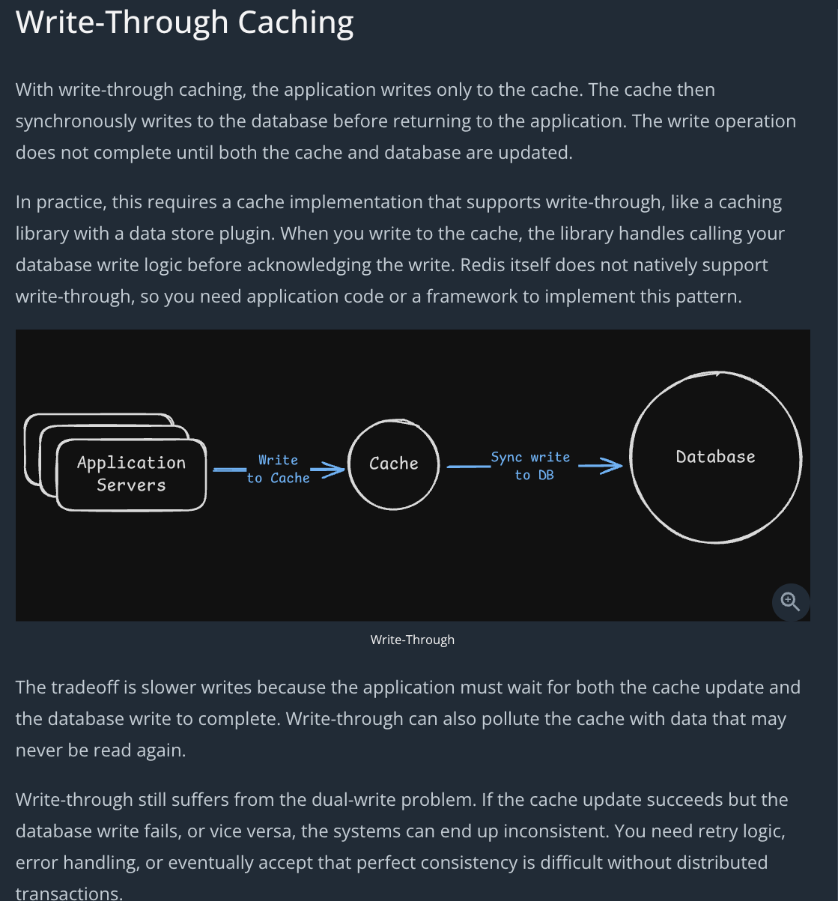
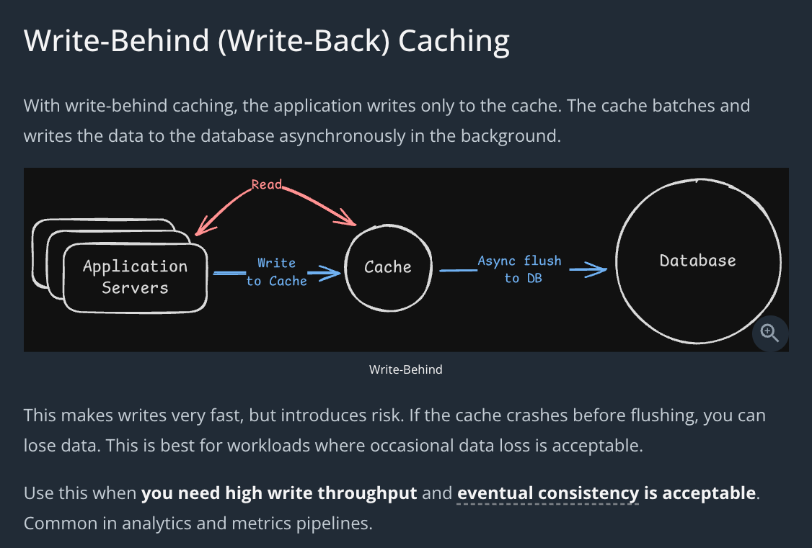
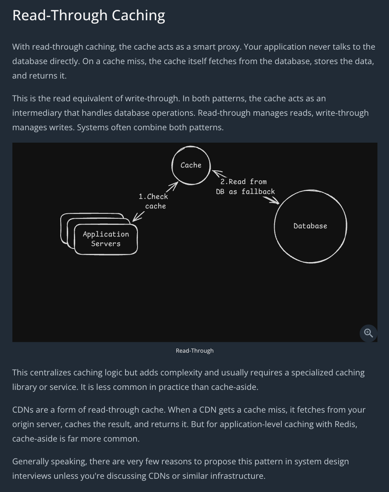
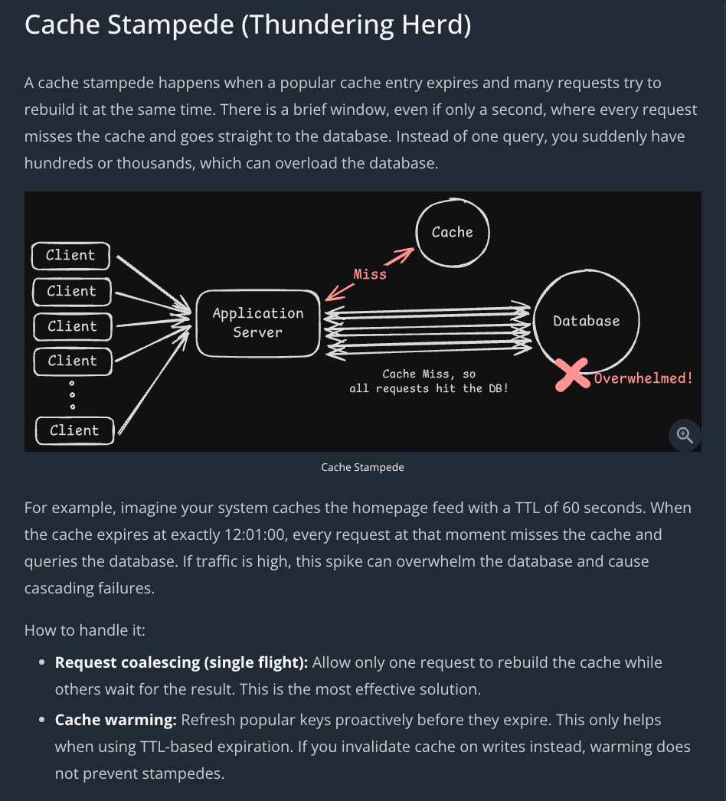
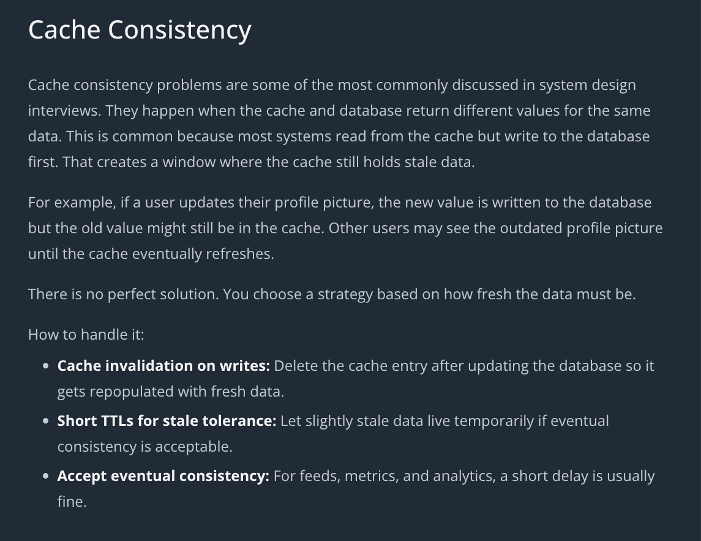
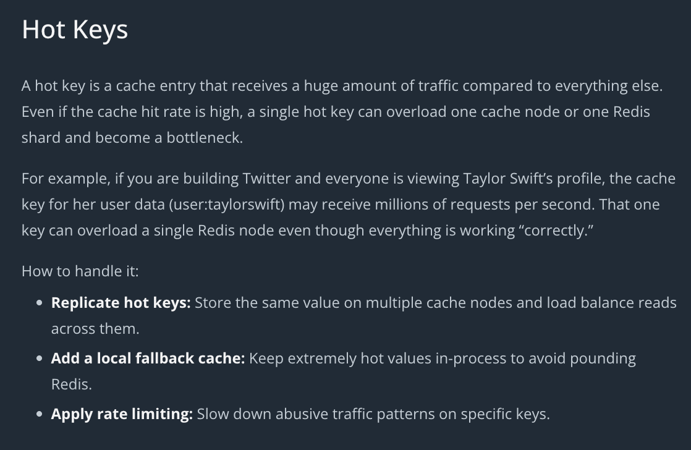

# Caching

Caches are essential for scalable systems. They reduce load on the database and cut latency dramatically. 

But caching shows up in multiple layers of a system. Browsers cache. CDNs cache. Applications cache. Even databases have built-in caching layers.

# Cache Architectures

# Common Caching Problems

