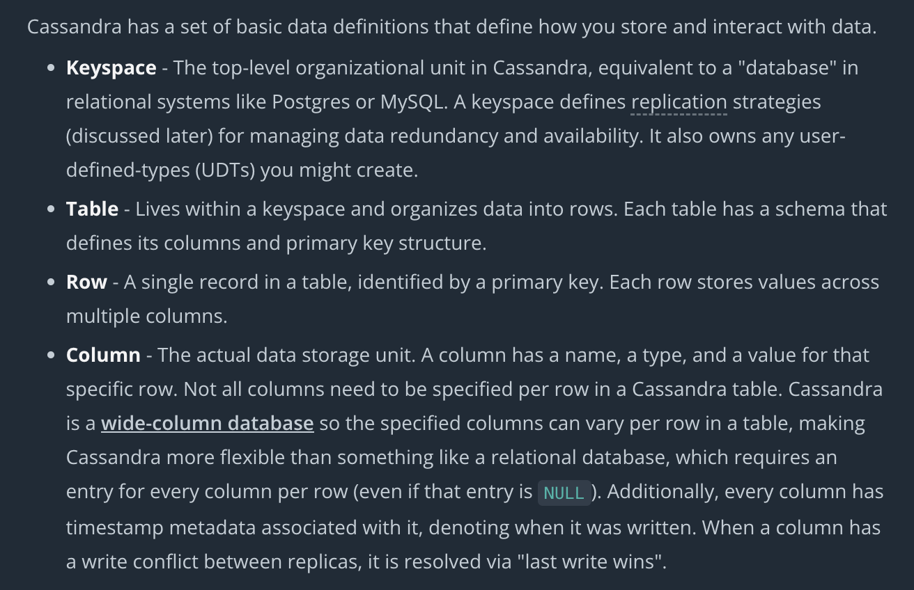
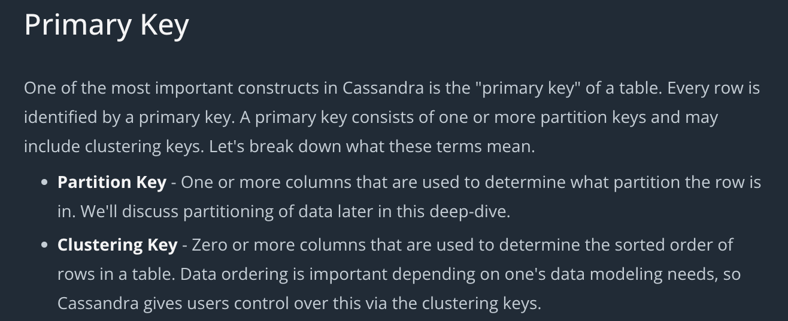

A wide-column database is a type of NoSQL database in which the names and format of the columns can vary across rows, even within the same table. Wide-column databases are also known as column family databases.

* Cassandra is a wide column database. 
* Use when we have predictable access patterns
* Use Consistent Hashing
* Gossip Protocol
* Tunable Consistency - One, Quoram, All
* High Throughput
* Use when Write >> Read
* Don't use when need flexibe queries

