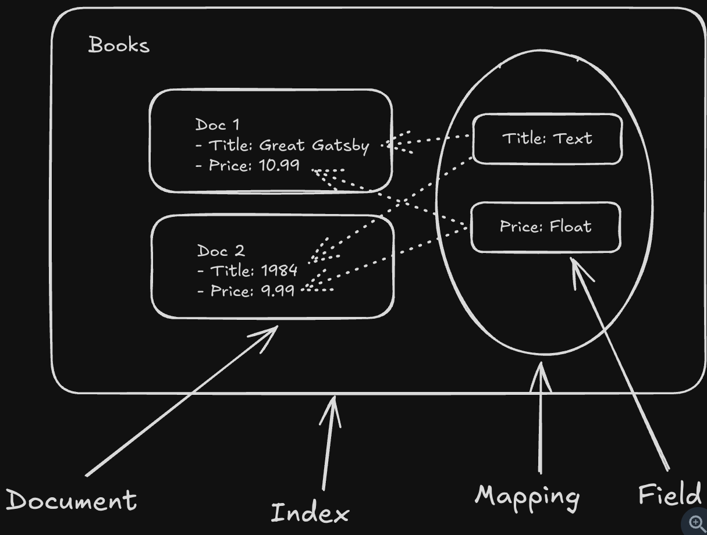
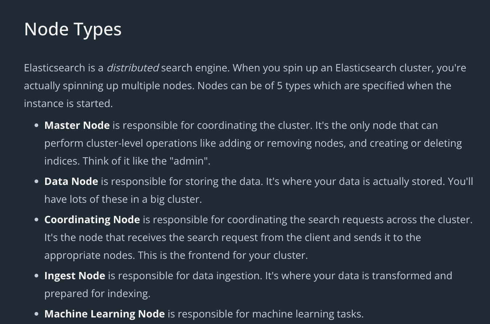
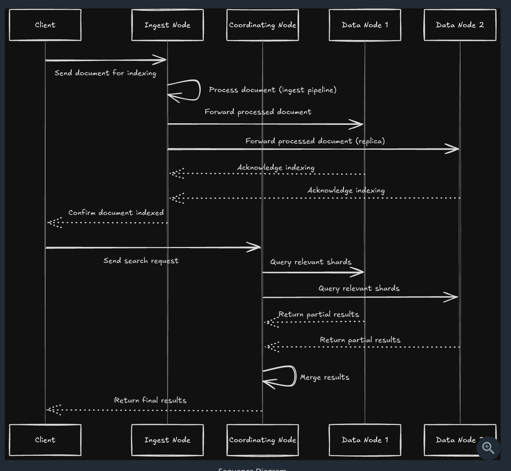

//PUT /books - For setting index
//PUT /books/_mapping - For Setting mapping, which field will be of what type
//POST /books/_doc - For adding the document
//PUT /books/_doc/{Id} - For Updating the document, Id we got in the post response
//GET /books/_search - For Searching with a body

- Elastic Search is good for GeoSpatial Search
- Elastic Search supports Sorting and Pagination as well. 
