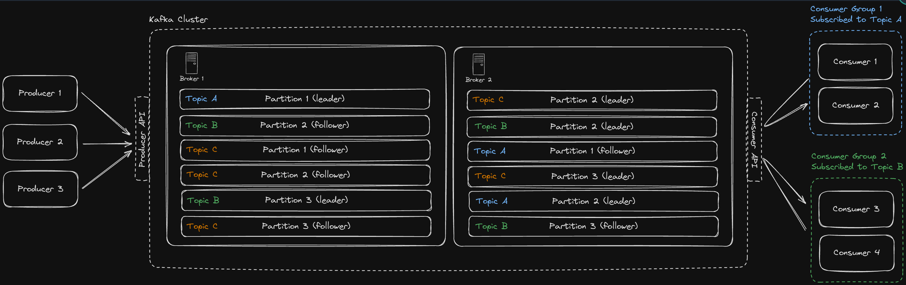
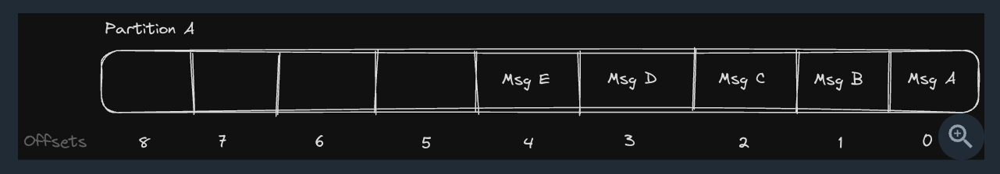
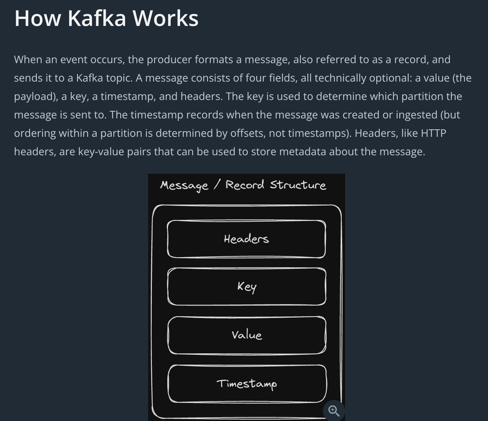

````
While not strictly required, the key is used to determine which partition the message is sent to. If you don't provide a key, Kafka will distribute messages across partitions using a default strategy (modern Kafka clients use a "sticky" partitioner that batches messages to the same partition for efficiency, then rotates). So when designing a large, distributed system like you're likely to be asked about in your interview, you'll want to use keys to ensure that related messages land on the same partition and are processed in order. The choice of that key is important. More on this later.
````

