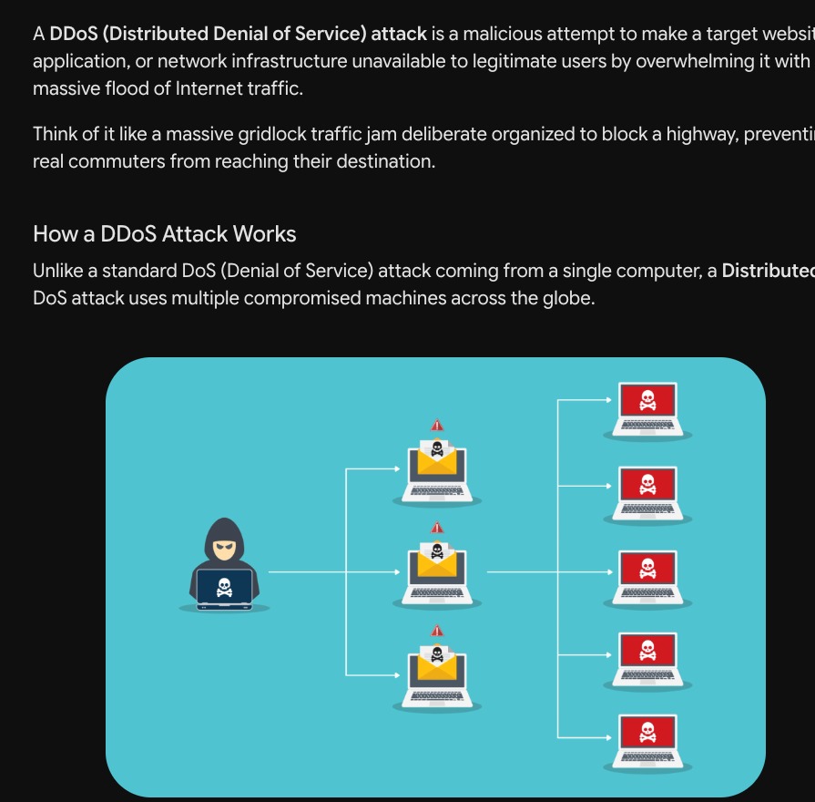
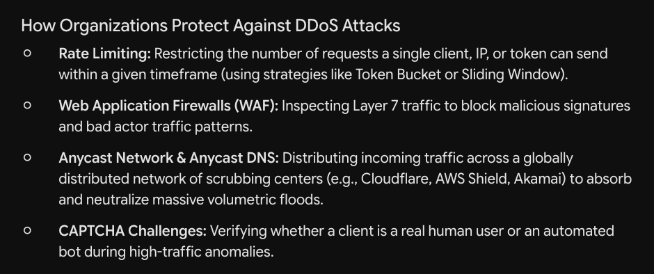
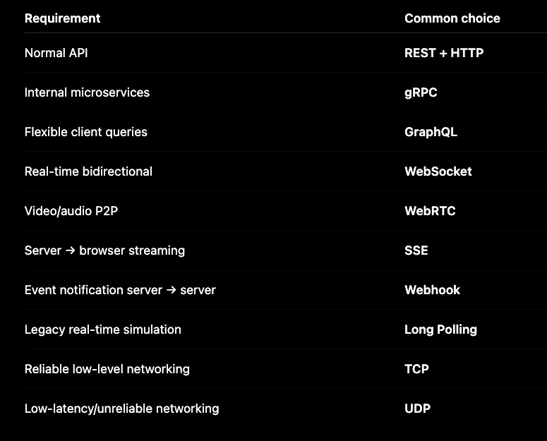
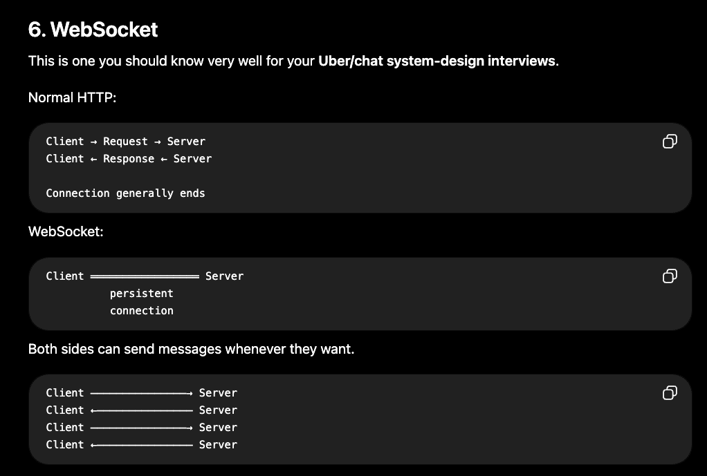

# DDOS

# Protocols

HTTP, TCP, UDP are protocols. REST is an architectural style. gRPC and GraphQL are API technologies. WebSocket/SSE/WebRTC are communication mechanisms/protocol technologies. Webhook and Long Polling are communication patterns.

#### SSE
Server continuously pushes events to the client over an HTTP connection.

#### WebHook
Webhook is basically "When something happens, call my HTTP endpoint."

#### WebRTC
WebRTC is primarily designed for real-time peer-to-peer communication. The media/data can flow directly between peers when network conditions allow, using supporting infrastructure such as signaling and STUN/TURN.

#### GraphQL - 
GraphQL allows the client to specify exactly what data it wants.

#### gRPC 
gRPC is designed particularly for service-to-service communication. Instead of JSON, it generally uses Protocol Buffers (Protobuf). I would generally consider gRPC for high-performance internal service-to-service communication, while REST is often convenient for external/public APIs.
