# OAuth2.0

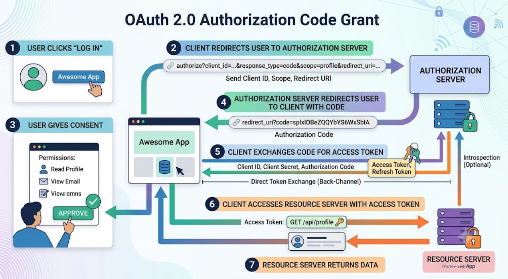

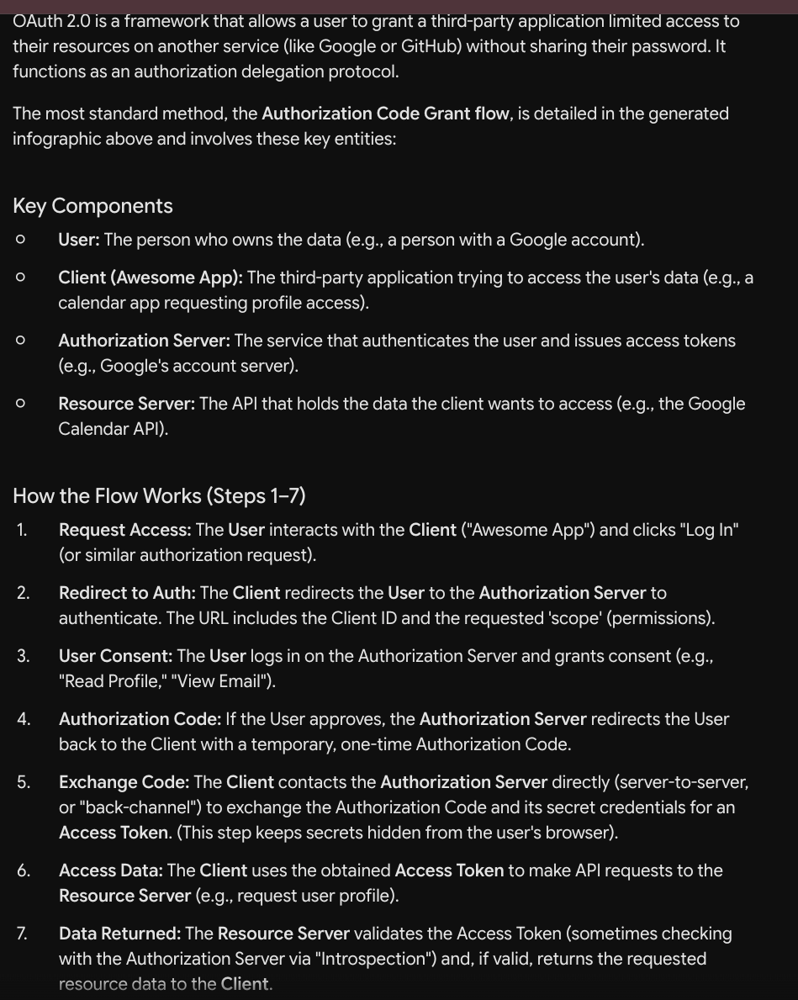

```
In step 5, the secret credentials belong to the Client (the third-party application, such as "Awesome App").   When the client exchanges the temporary authorization code for an access token, it sends its own Client ID and Client Secret (along with the code) directly to the authorization server in a secure back-channel request. This authenticates the application itself to prove to the authorization server that it is indeed the legitimate app authorized to receive the token, keeping its client secret securely hidden from the user's browser. 
```

# JWT

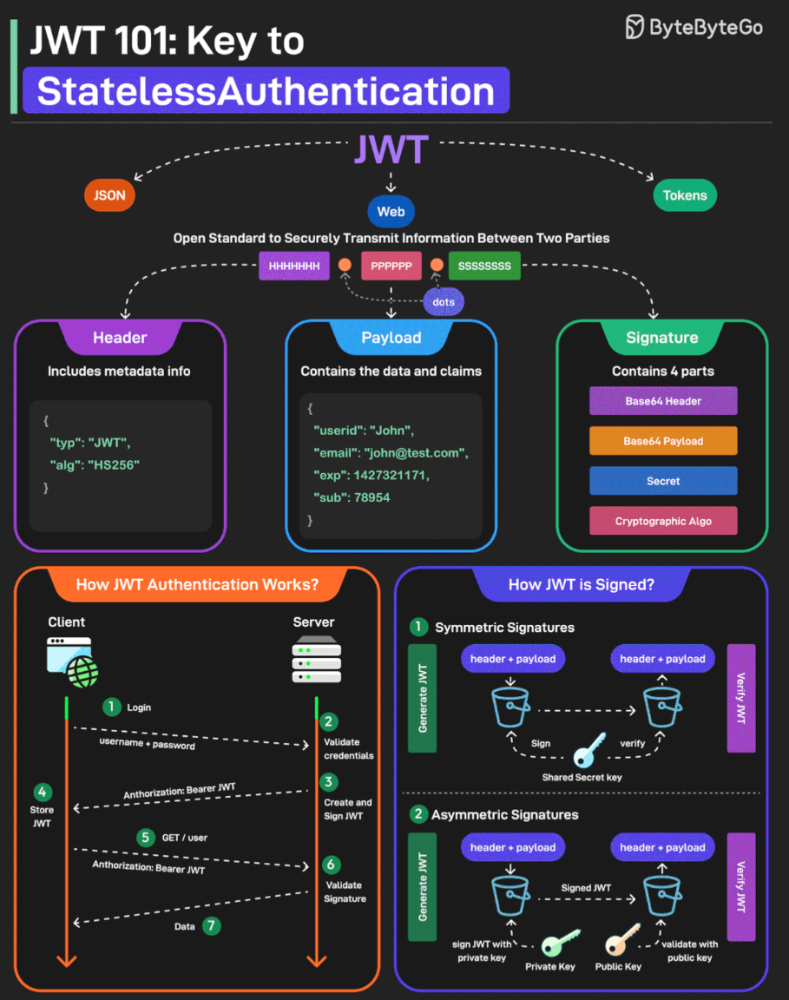

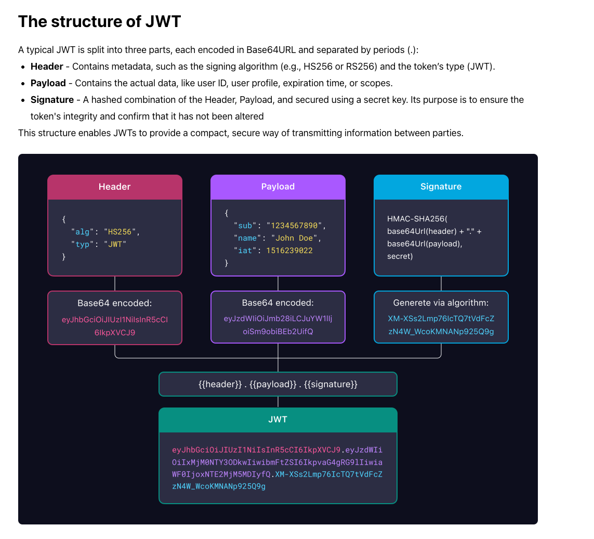

https://developer.okta.com/blog/2019/10/21/illustrated-guide-to-oauth-and-oidc

# OAuth2.0

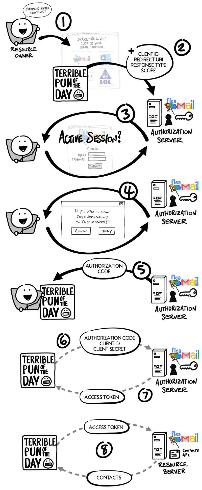

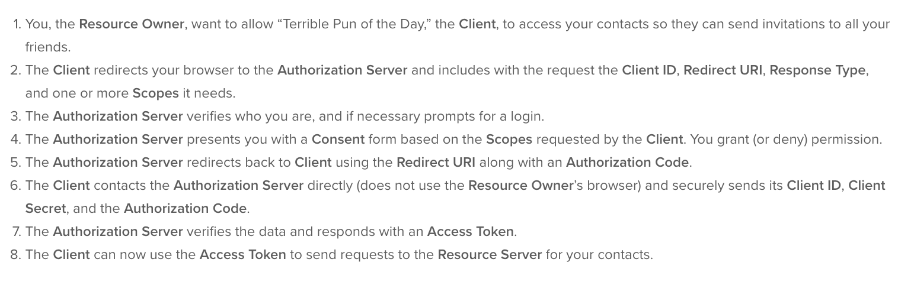

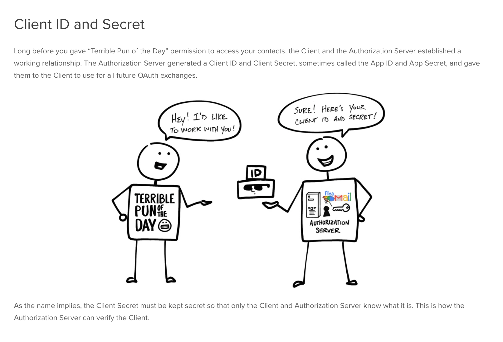

# OpenID Connect

### The key difference is: OAuth 2.0 is for authorization (accessing resources), whereas OpenID Connect (OIDC) adds authentication (identifying the user) on top of OAuth 2.0.

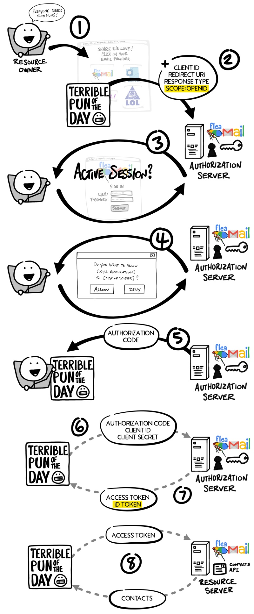

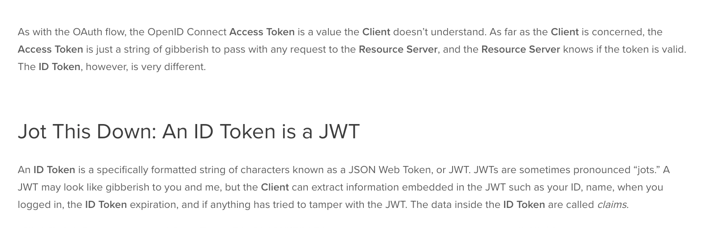

# SSO Single Sign On

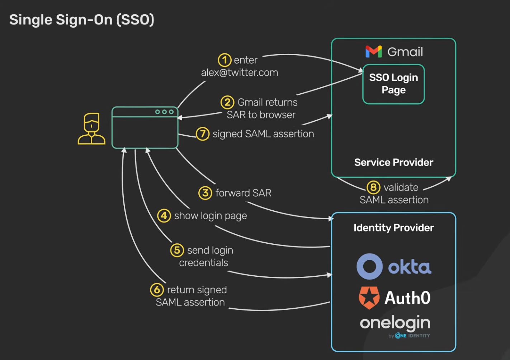

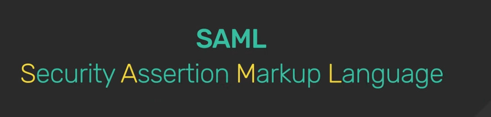

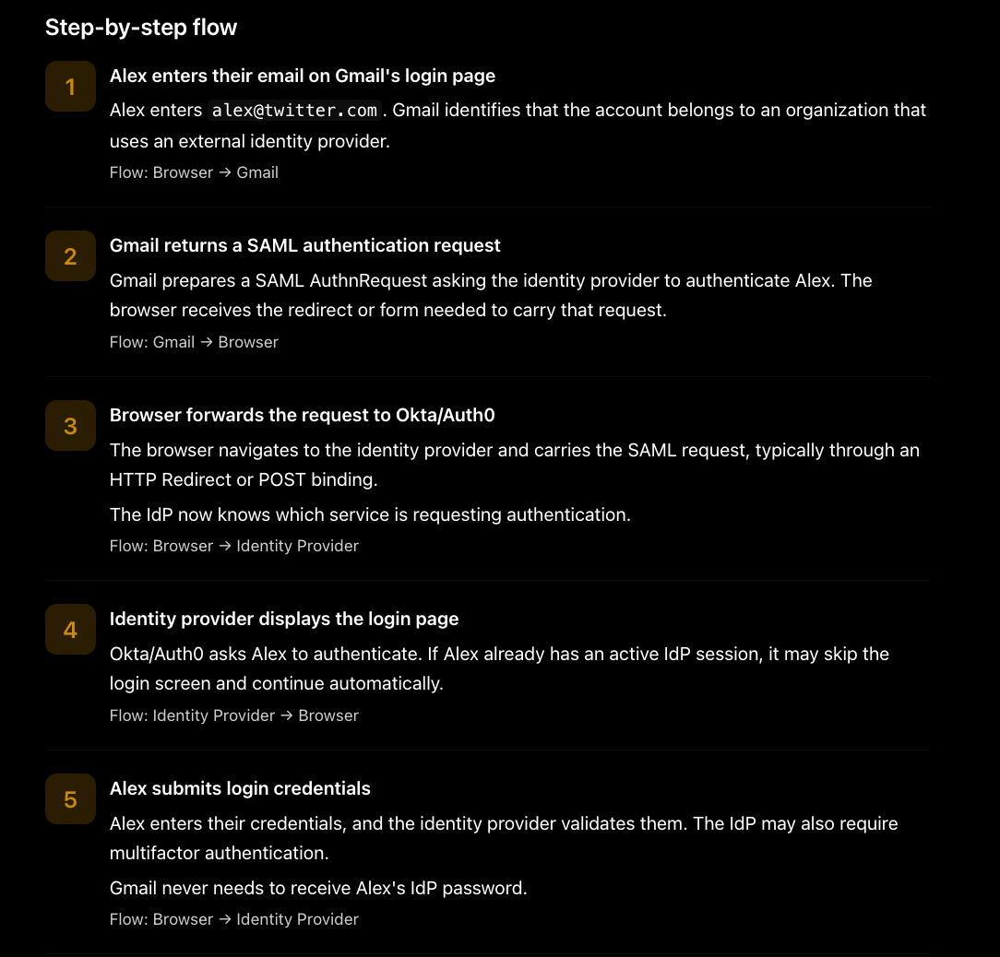

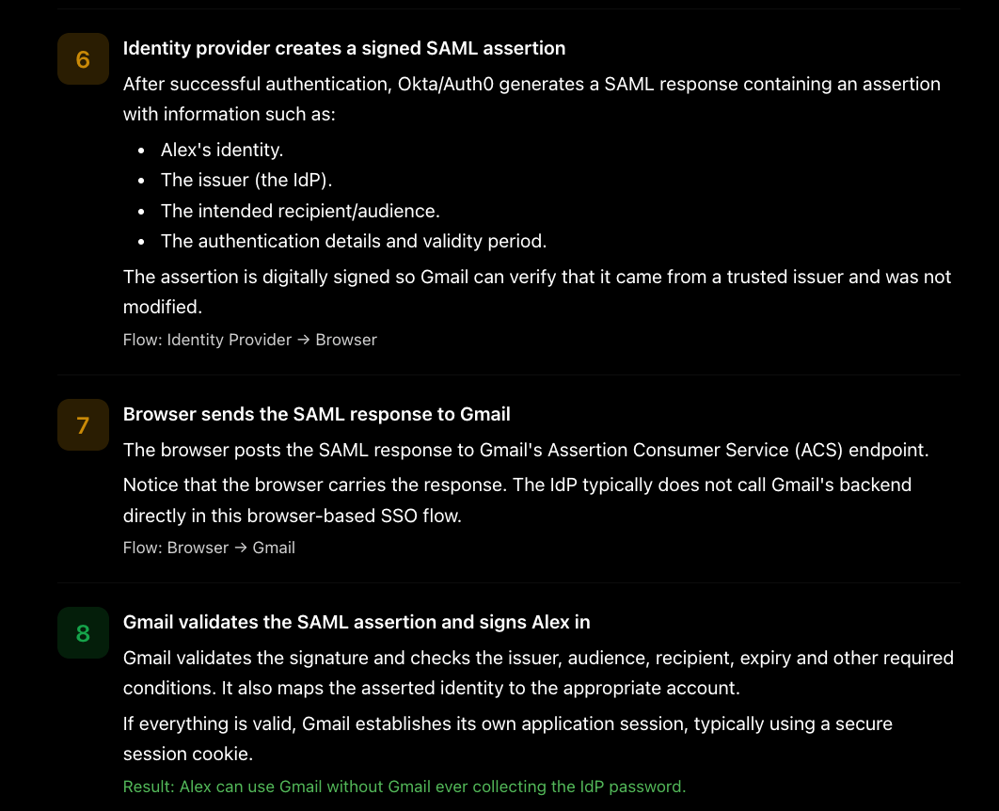

