# Redis is a single threaded, inMemory DataStructure


# InMemoryDatabase
When we say Redis is an in-memory data store, it means Redis keeps its working dataset in the server's RAM (Random Access Memory) instead of needing to read data from an SSD or HDD for every request.

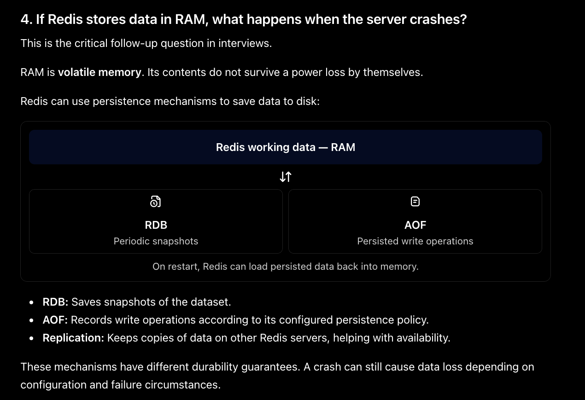


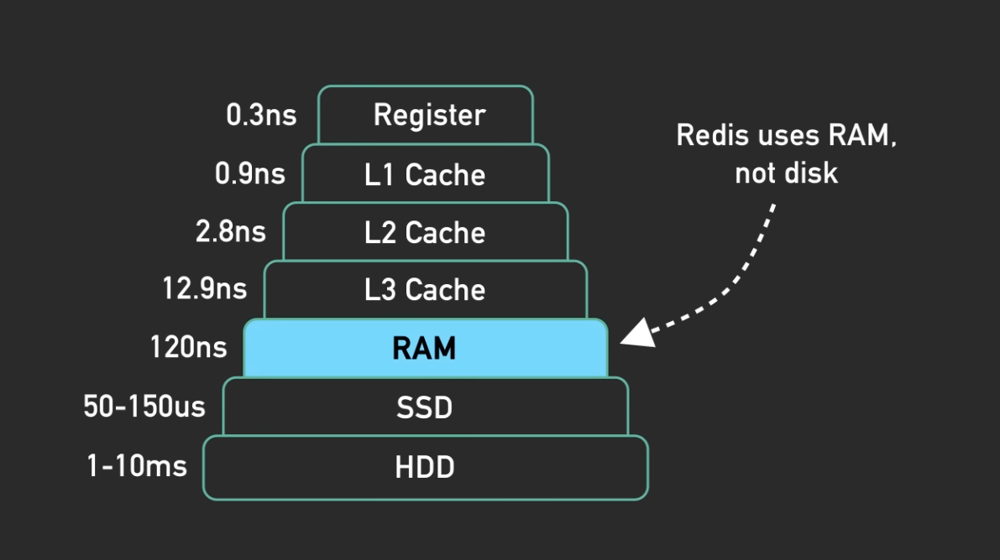

# Single Threaded

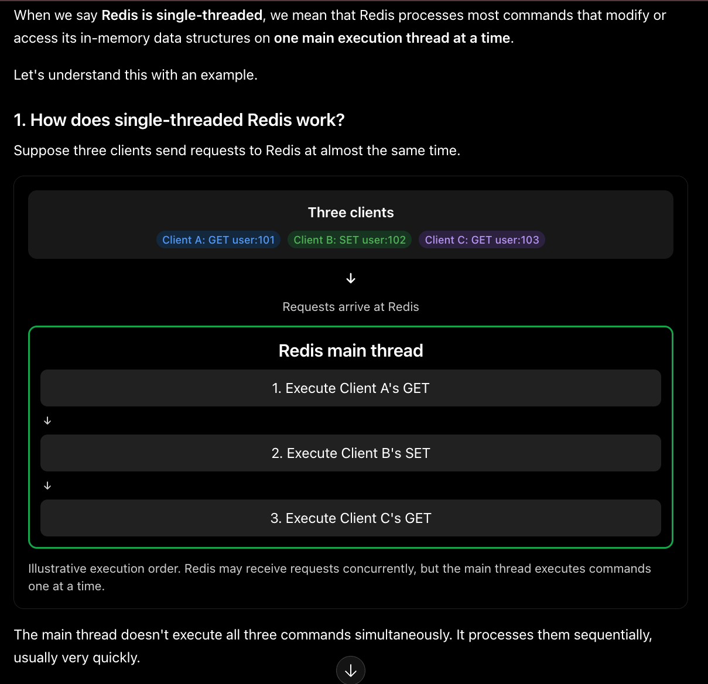

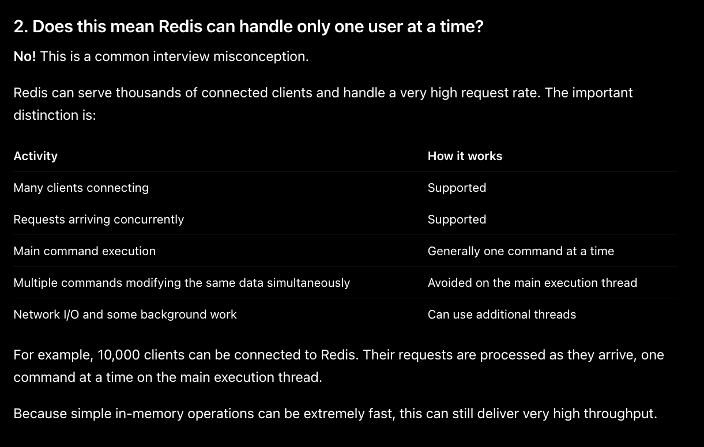

The main reason redis chosed this design is to simplify concurrent access to shared data.

Values

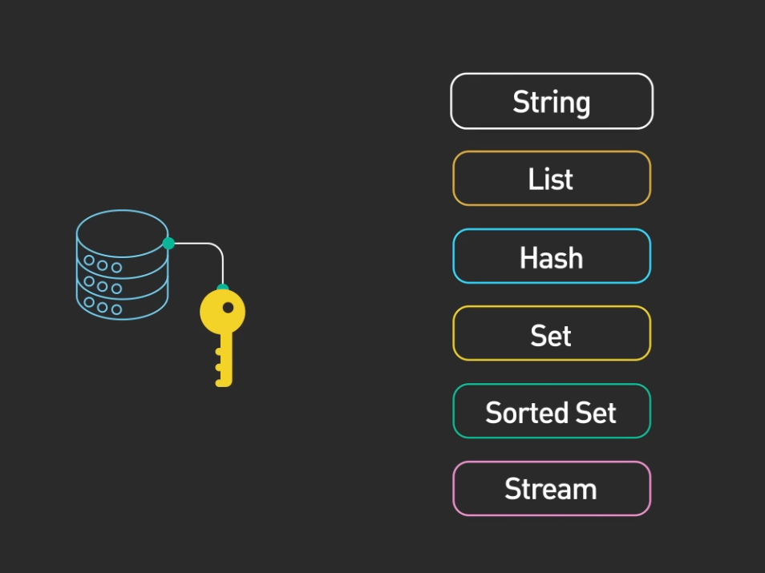

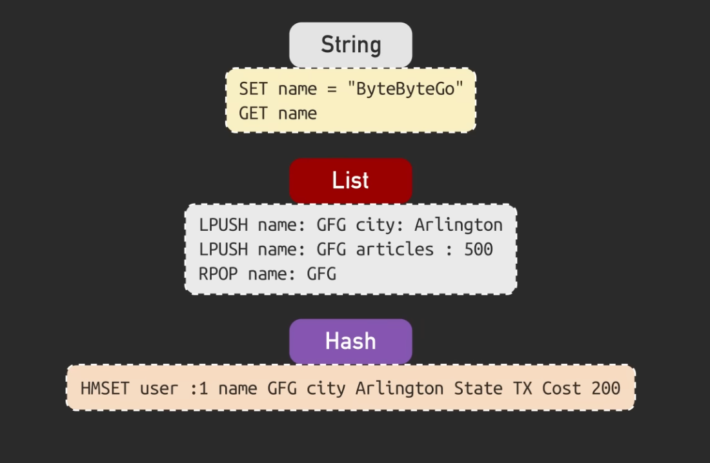

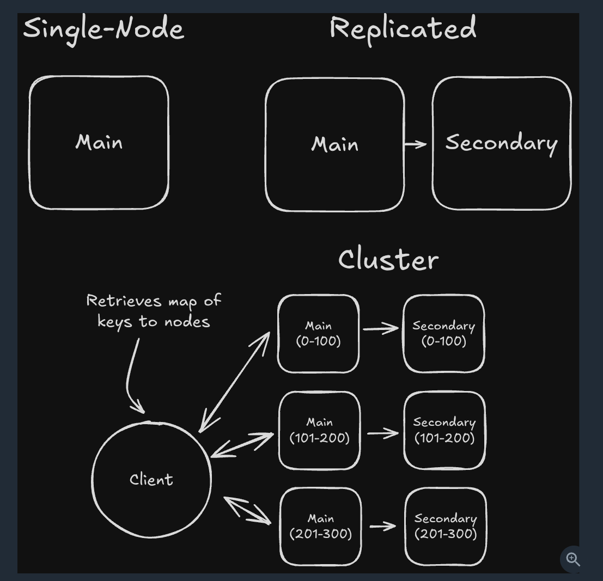

# How does Redis write works

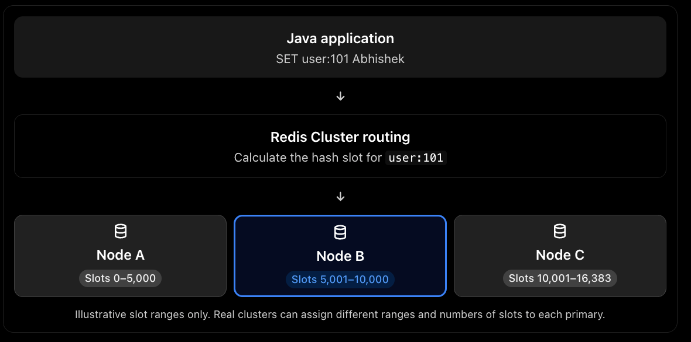

The key idea is: Redis Cluster has 16,384 hash slots, and every key is mapped to one slot. That slot determines which Redis primary node stores the key.

## slot=CRC16(key)mod16384


This is disabled as we want to use it just as a cache. Don't mention below two persistent models in interview.
Redis provides two main persistence options to save data to disk: RDB and AOF. 

## RDB (Real-time Data Base) Persistence Model:
   RDB is a point-in-time snapshot of the Redis dataset stored as a binary file. 


## AOF (Append-Only File) Persistence Model
AOF logs all write operations to a file in a human-readable format.

Redis Commands

String
````
SET mykey "Hello"
GET mykey
````

# Distributed Lock

# SET lock:order:101 unique-token NX EX 30

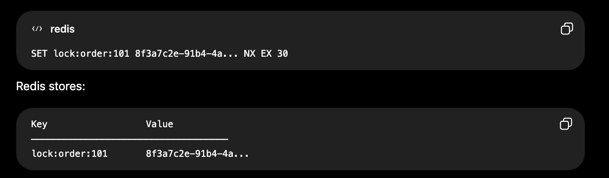

````
SET is the Redis command to create or update a key with a value.

lock:order:101 is Redis Key, nothing magical about it. We can rename it something else as well.

NX = Not eXists -> Set the key only if the key does NOT already exist.

````

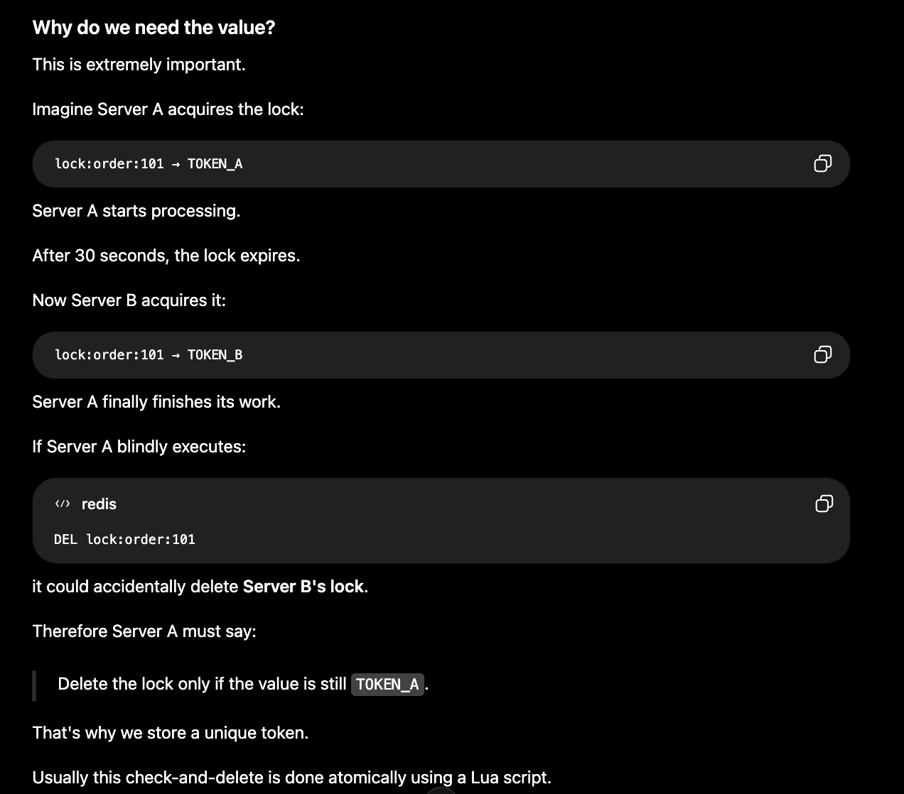

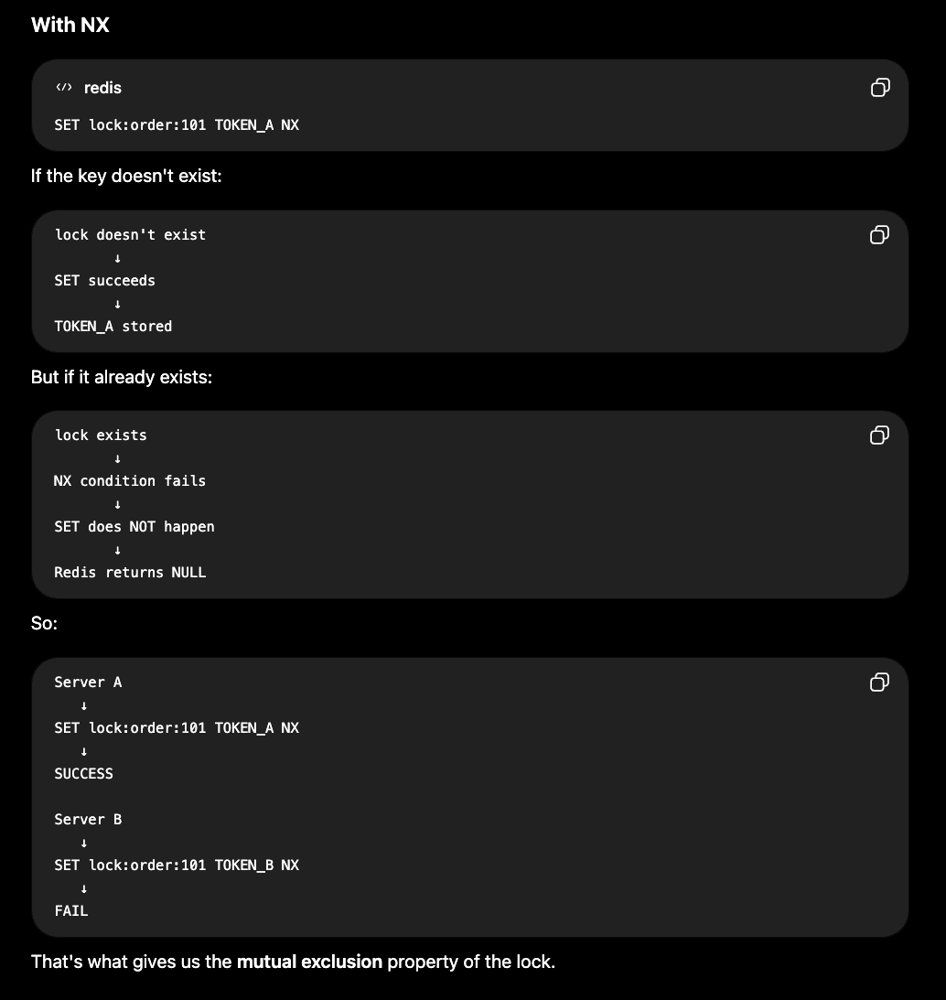

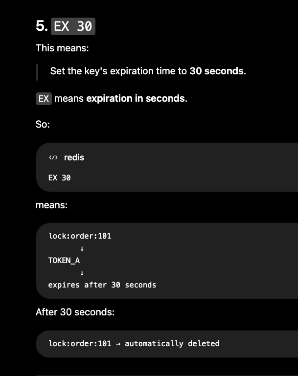

## Search using latitude and longitude

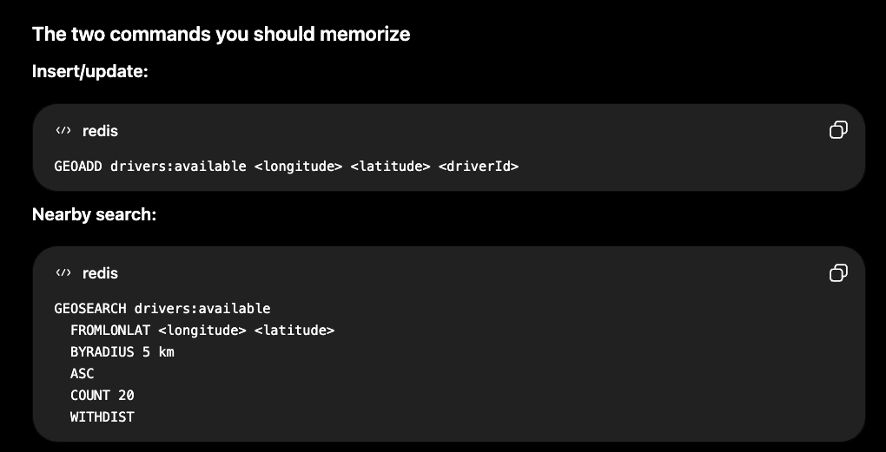


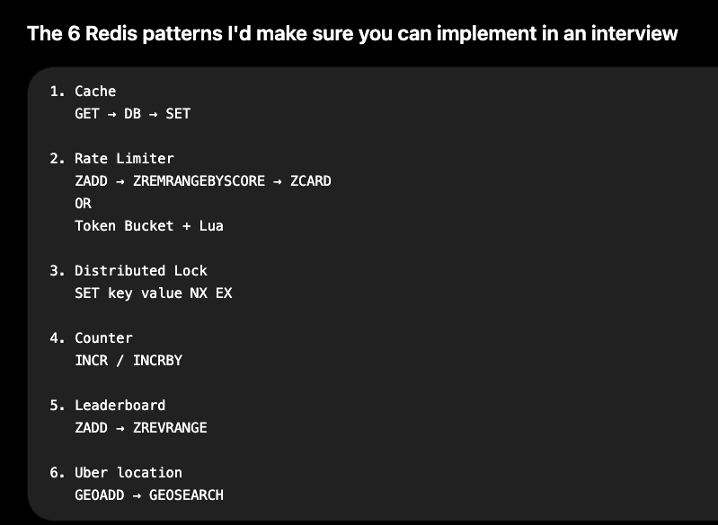

## Dream 11 UseCase

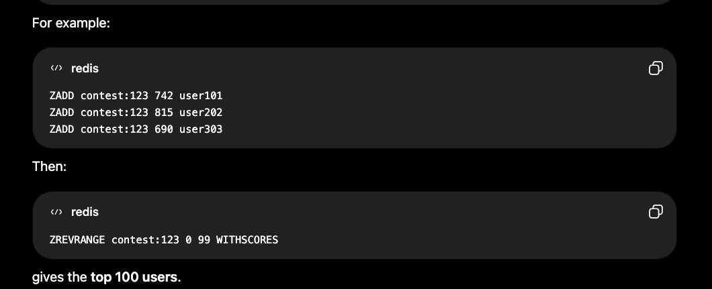

For incrementing ZINCRBY contest:123 50 user101

Its a sortedSet

## RateLimiter Token Bucket Algorithm

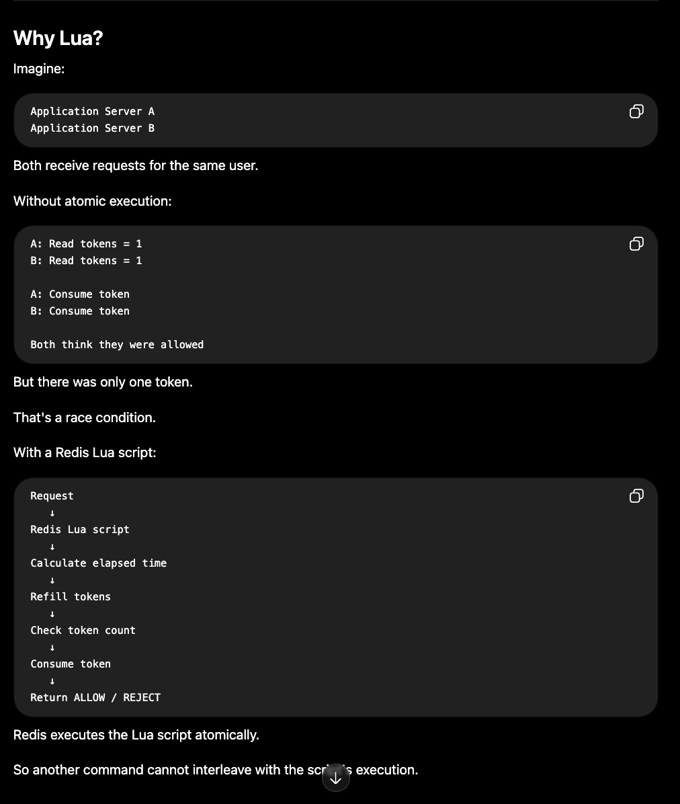