---------
###SYSTEM DESIGN

---------
1) Functional Requirements
2) NonFunctional Requirements - High Availability, Scalability, Low Latency
3) Capacity Estimations - 

---------

LC6K

1) ###Load Balancer - 
   - Types - (Network Layer(L4), Application Layer(L7)) - Software Hardware -
   - Routing Algorithms : a) RoundRobin b) Weighted Round Robin c) Least Connections d) Least Response Time e) Least Bandwidth f) Hashing
   - Features - Autoscaling, Sticky Sessions, HealthChecks, Encryption, Caching, Logging, Request Redirects, Fixed Response
   - Eg : Nginx, Amazon Elastic Load Balancing
   
2) ###CAP Theorem - DB (SQL/NoSQL) - ACID/BASE - Sharding
   - C - Consistency - Consistency means all clients should see the same data at the same time no matter which node they are connected to
   - A - Availability - Availability means any client making a request for data should get a response ()
   - P - Partition Tolerance - Partition Tolerance means system continues to work despite message loss or partial failure
   
    CA - PostgreSql CP - MongoDb AP - Cassandra
   
3)  ###Caching
    - Cache Hit, Cache Miss
    - Types - WriteThoughCache, WriteAroundCache, WriteBackCache
    - Eviction Policy - FIFO, LIFO, LRU, MRU, LFU
    - eg. : Redis, Memcached, Amazon Elastic Cache
   
4) ###CDN
    - CDN is a group of geographically distributed servers that work together to provide fast delivery of internet content.Static Files(Such as Html/CSS/JS)
    - Push CDN(Small Traffic), Pull CDN(Huge Traffic)
    - CloudFront
   
5) ###CQRS - Command Query Responsibility Segregation
   - Event Sourcing 
   - ReadWrite DB
   
6) ###Circuit Breaker
   - CLOSED - Everything normal
   - OPEN - Open circuit break in case of errors beyond threshold
   - HALF OPEN - First Error occurred
    
7) ###Consistent Hashing
   - Ring, Server distributed, Hash on Key and servers, index
    
8) ###Kafka
   - Broker, Topic, Partition, Offset
    - Producer - Broker - Consumer Groups
    - ZooKeeper 

---------

Reporting, Data Team, User Team, Rate Limiter

1) ###Analytics
2) ###User Service
   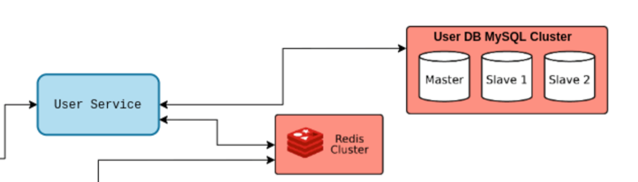
3) ###Rate Limiter
   - Leaky Bucket - FIFO
   - Token Bucket - Every refresh Token is kept in bucket
   - Fixed Window - Requests in window
   - Sliding Log - All the requests stored in time stamped log
   - Sliding Window
   
   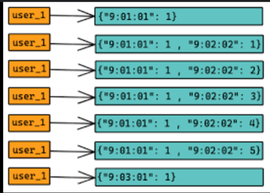
4) ###Web Sockets
   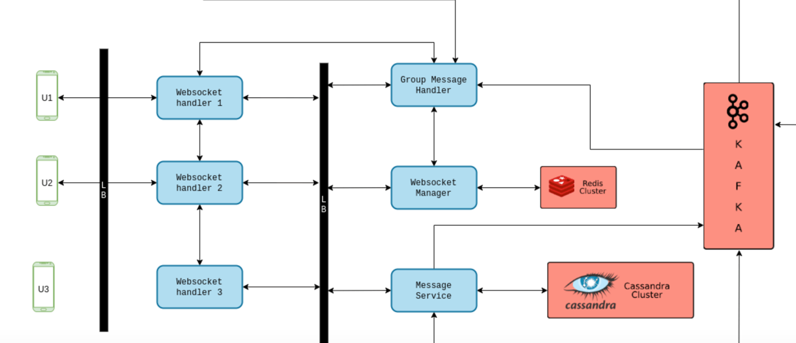

5) Auto Scaling
   - Scale Out - Increase no of instances
   - Scale In - Decrease no of instances
   
   - CloudWatch Alarms & Scale - 
   
   Dynamic Scaling Policies
   - Target Tracking Scaling _ I want CPU to stay around 40%
   - Simple Step Scaling - CPU > 70% add 2 units, CPU > 30% add 1 unit
   - Scheduled Actions - Anticipate a scaling based on usage patterns

   - Scaling Cooldown period 300 seconds
   
---------
1) ###S3, 

````
Object Level Storage

Objects have keys, which are full path

s3://my-bucket

Max Size is 5TB
If uploading more than 5GB use multipard upload

Versioning
````

S3 Storage Classes

````
Standard Genral Purpose - Used for frequent Accessed data - 99.99% Availability
Standard Infrequent Access - Data that is les fequent accessed but requires rapid when needed, Disaster Recovery Backups
OneZone Infrequent Access - Data that is les fequent accessed but requires rapid when needed, Data lost when AZ is destoryed

For long term storage
Glacier Instant Retrieval - 
Glacier Flexible Retrieval
Glacier Deep Archive


Intelligent Tiering - Based on lifecycle rules, objects are transitioned between storage classes 
````


2) ###ElasticSearch

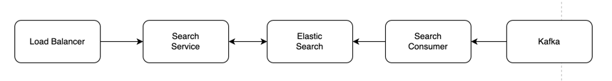

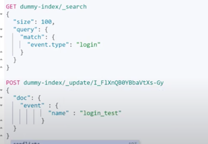
---------


1) ###Notifications

- SNS SES

2) ###Asset Management System

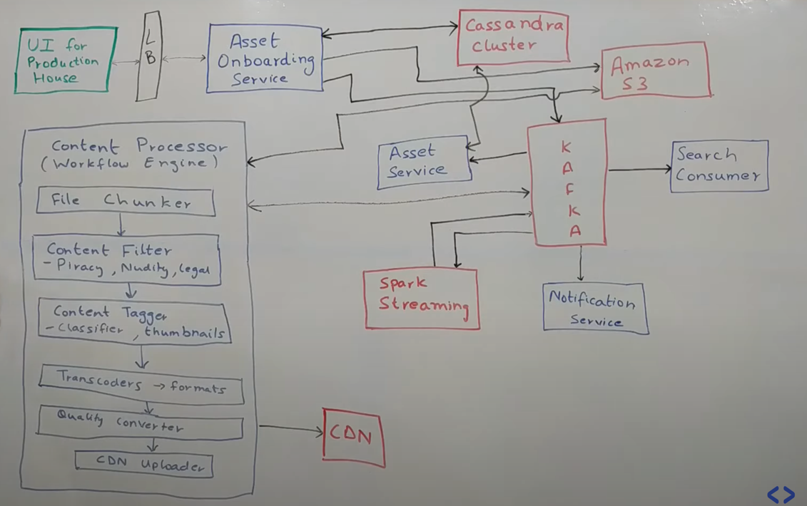
---------


1) ###OrderManagementSystem

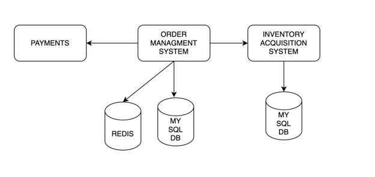

2) ###Inbound Services
3) ###InventoryAcquisitionSystem
4) ###Payments


###WebRTC
- PeerToPeerConnection
- If public ip is accessible connection through stun server, peer to peer conncection.
- If there is some firewall etc, we will connect via turn server
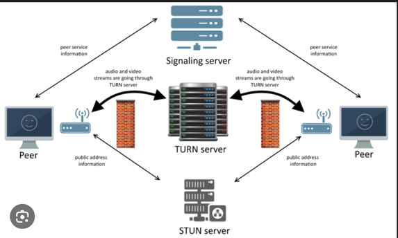


###UniqueIdGenerator
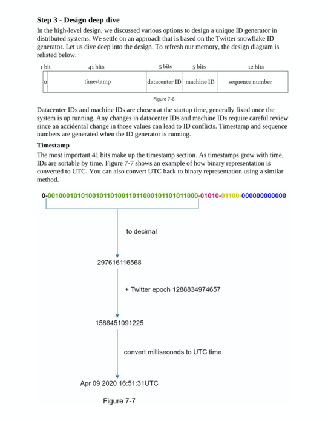

Twitter Snow flake Algo

###TinyURL
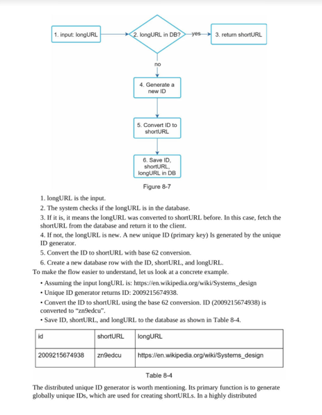


###WebCrawler
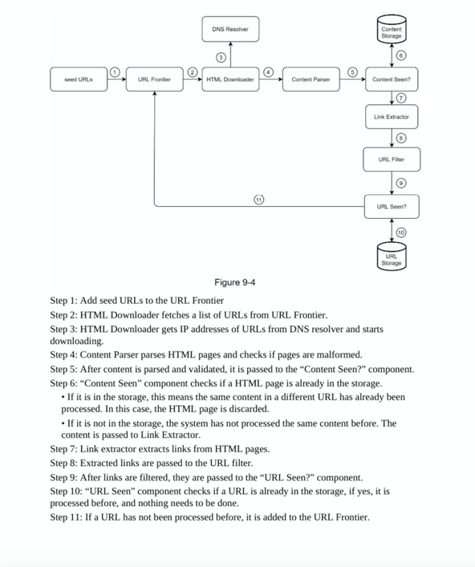

###Fanout Service

Fanout on Write : Post is pushed to all friends timeline at time of publish

Fanout on Read : OnDemand Model. Recent Posts are pulled when user loads his home page.
   - Inactive Users


DNS - Route 53

Region 
Availability Zones
Data Centres

Region can have multiple AZ, AZ can have one or more DC


Replication

EC2 - Elastic Cloud Computing - VM

````
Unicast IP - One Server holds one IP Address
Anycast IP - All servers hold same IP address and the client is routed to the nearest one

AWS Global Accelerator - 2 Anycast IP are created for your application
````

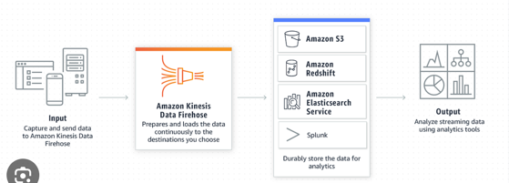

````
ECS - Elastic Container Service
EKS - Elastic Kubernetes Service
AWS Fargate - AWS Servless container Platform

ECR - Storage Container images

CloudWatch - Provides metrics for each and every service in AWS

````