Requirements

Functional
````
User registration/login
1-to-1 messaging
Group messaging
Online/offline presence
Message delivery & read receipts
Push notifications
Send images/videos/files
Message history
Multi-device support
````

Non-functional
````
Very high availability
Low message latency
Messages should not be lost
Ordered messages within a conversation
Horizontal scalability
End-to-end encryption
Eventual consistency is acceptable for presence/read receipts
````

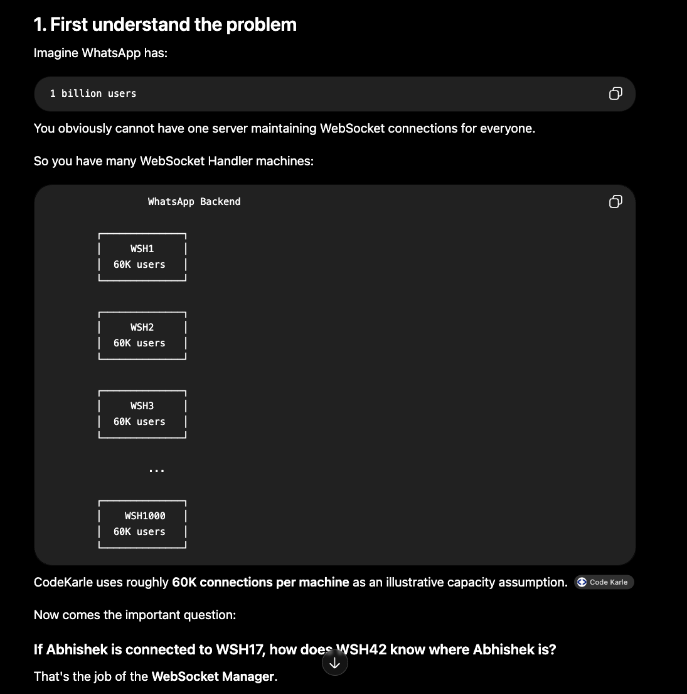
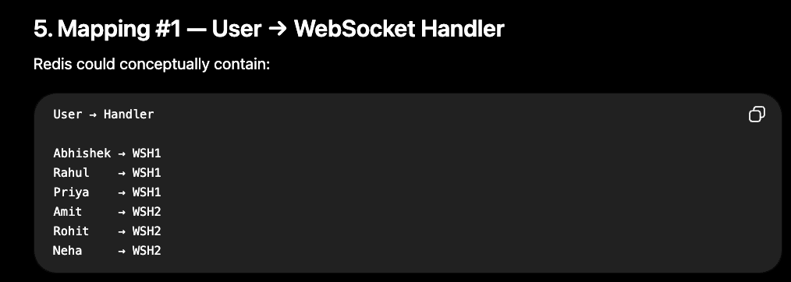
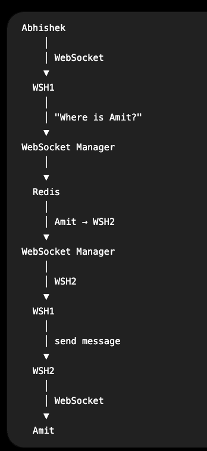
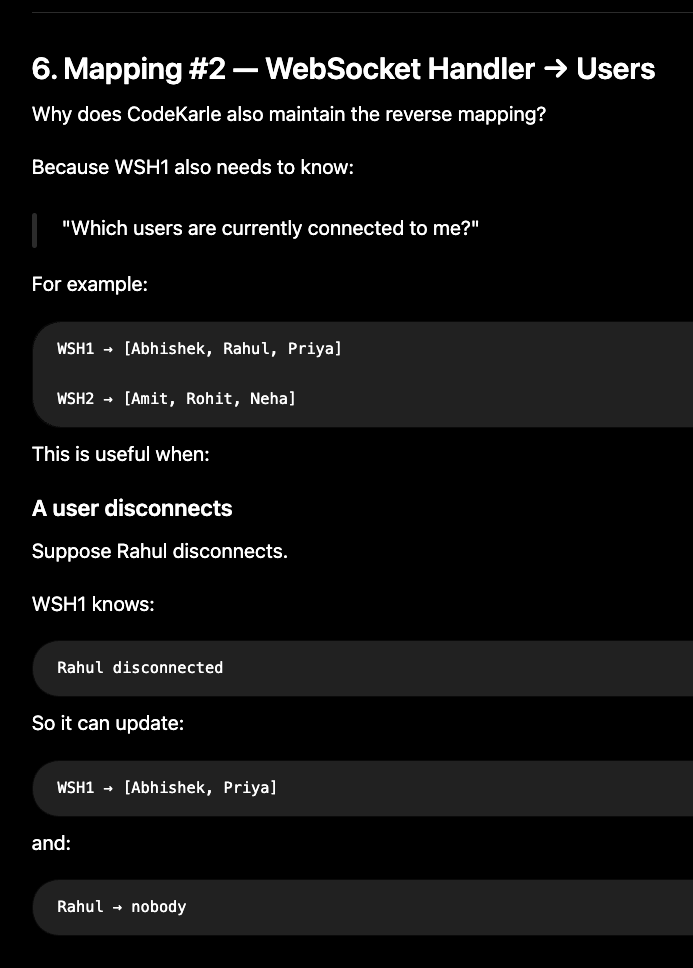
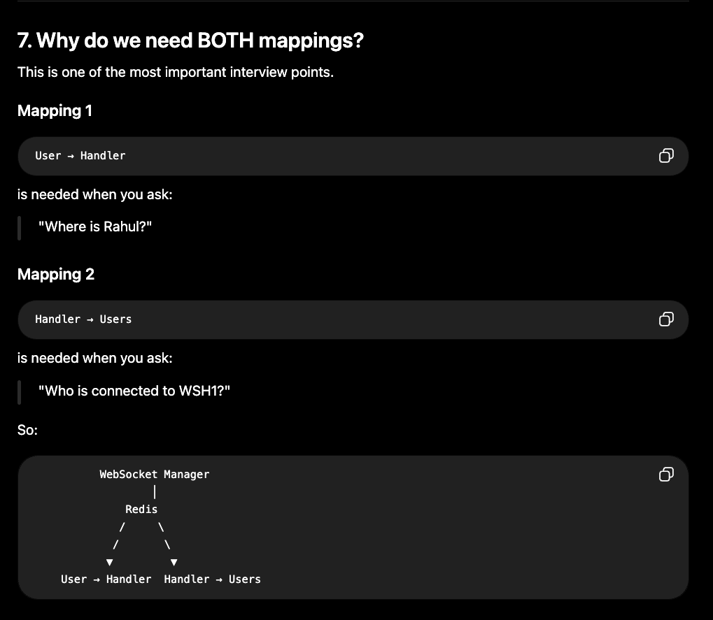
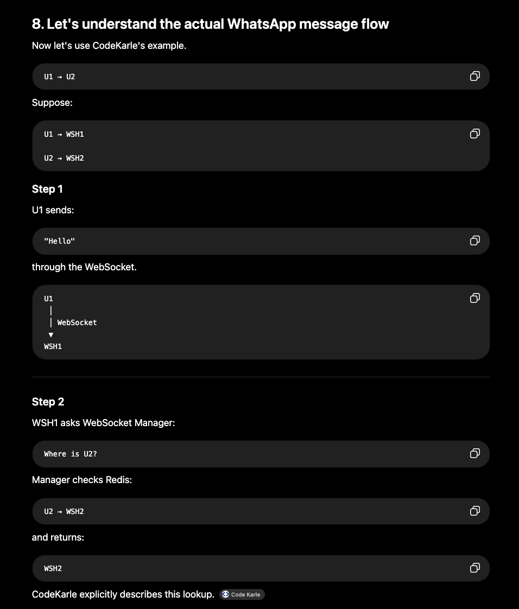

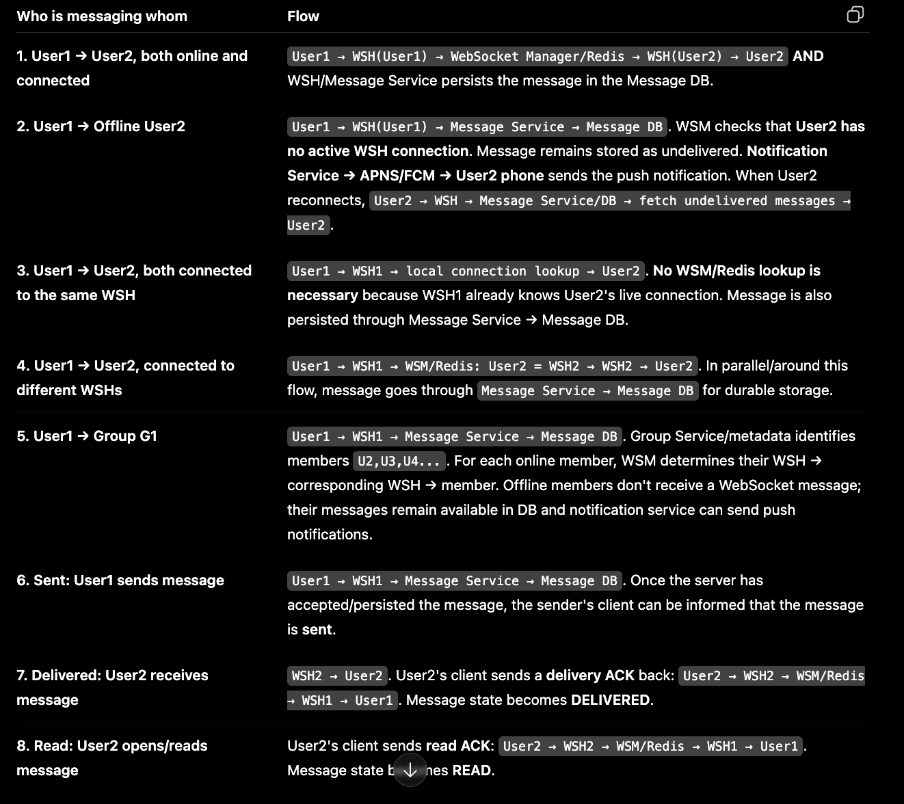

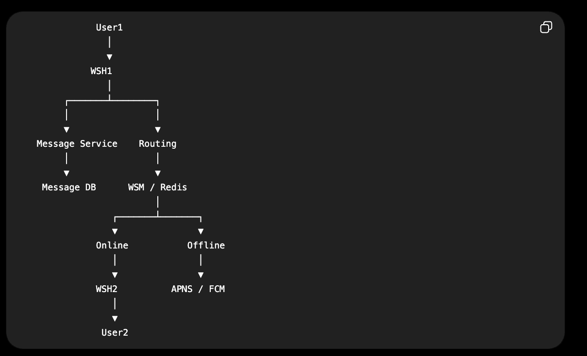

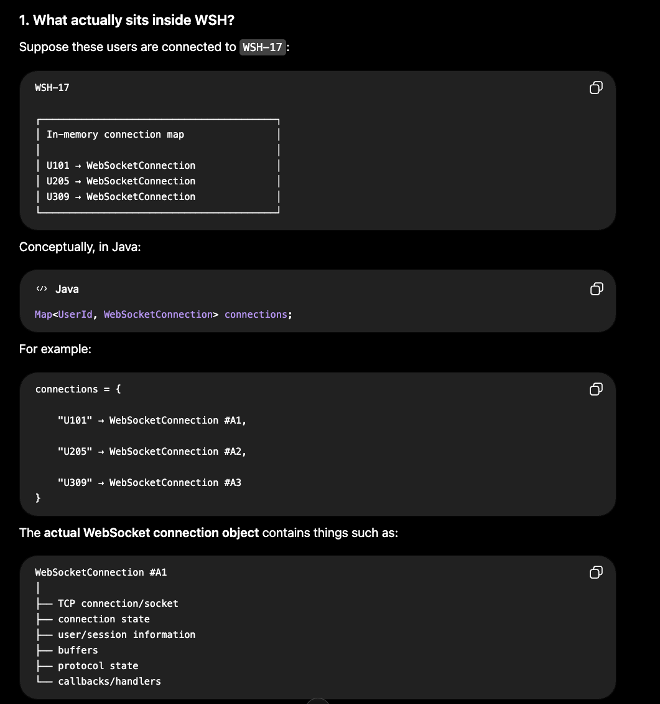

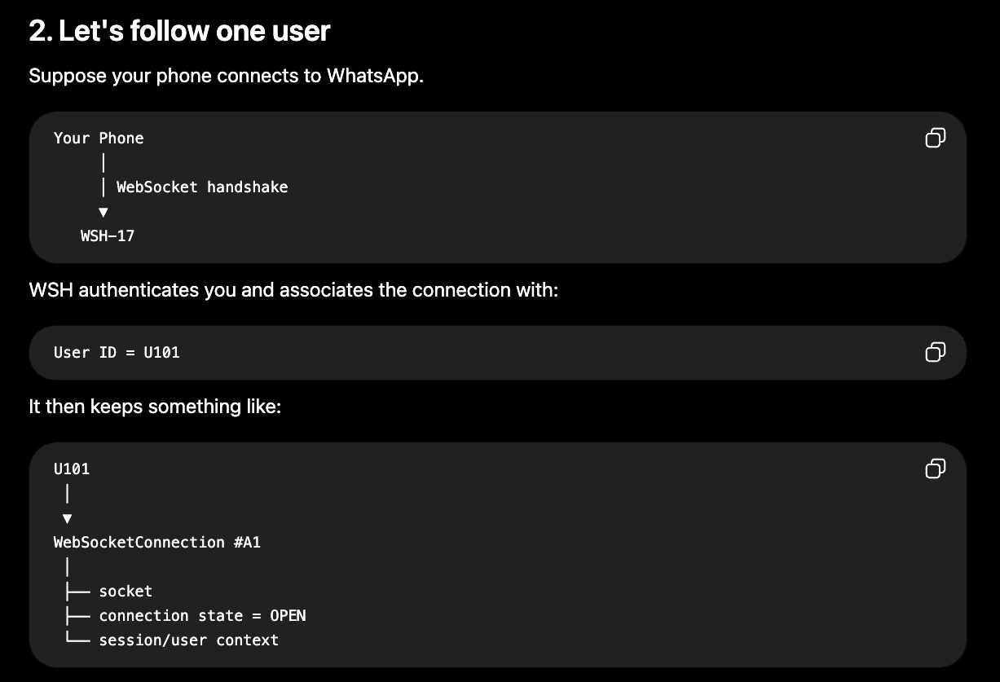
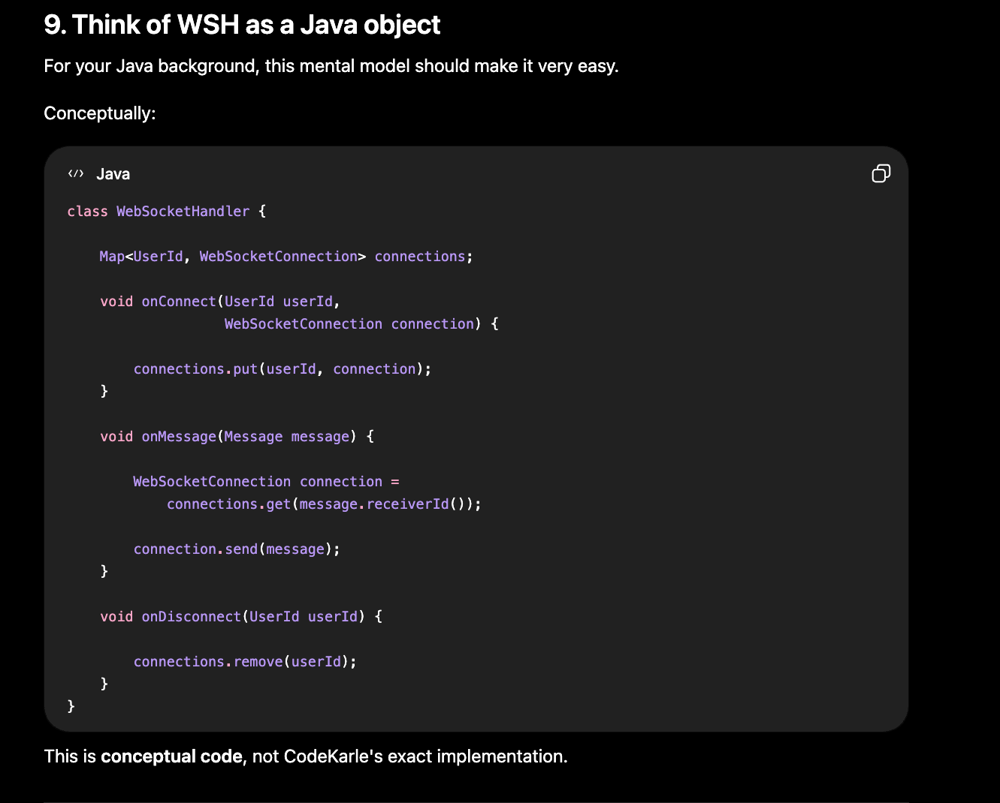
