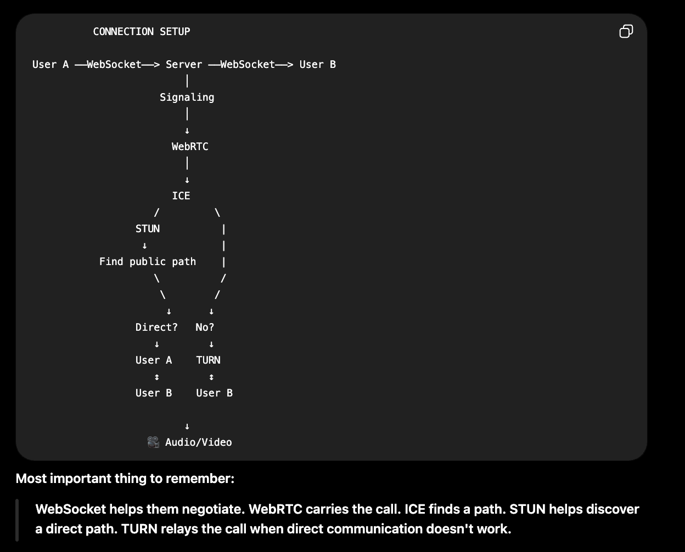
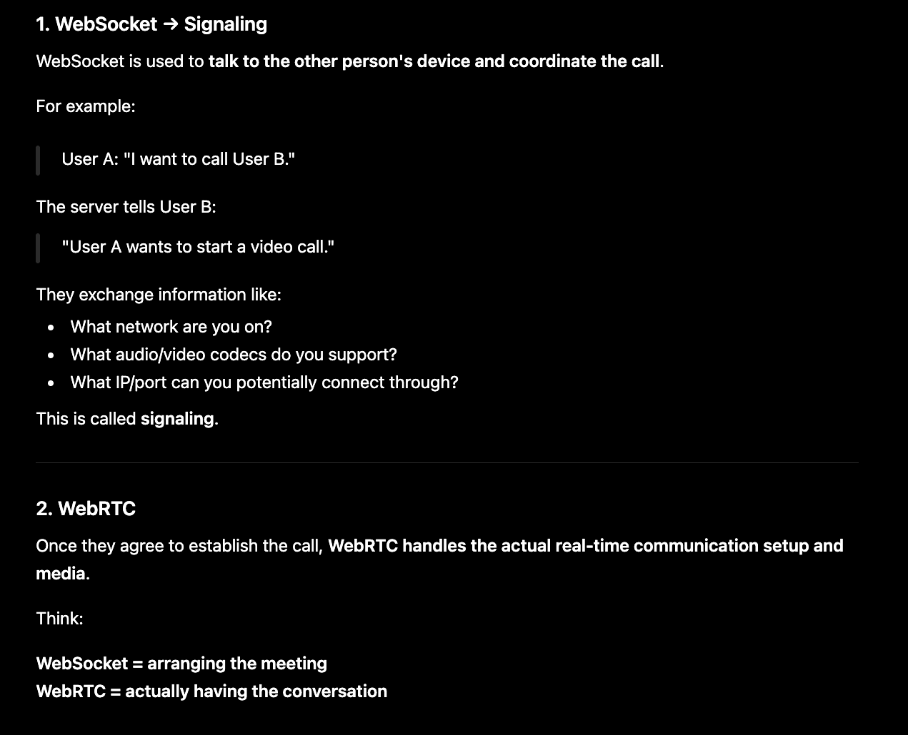
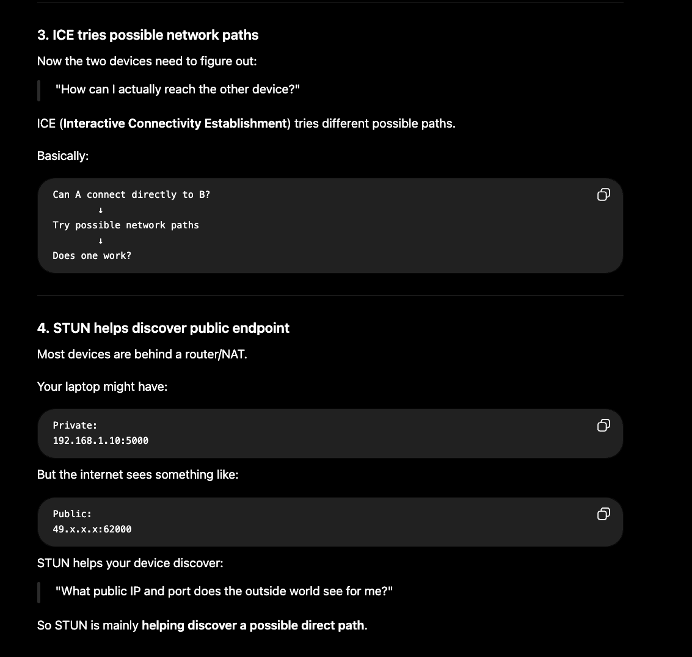
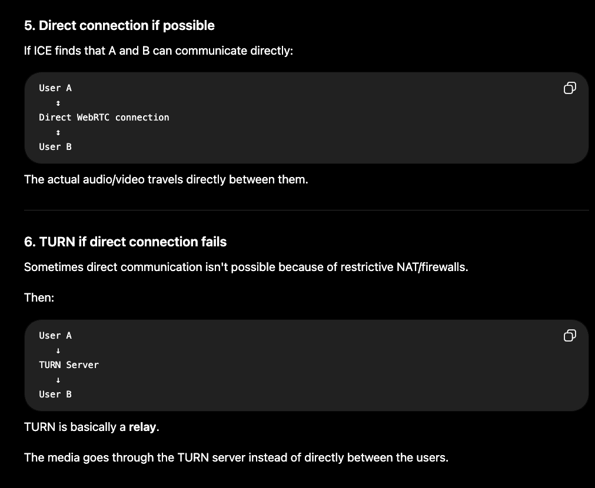
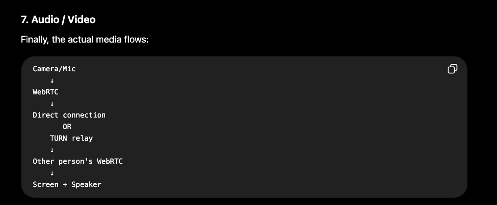
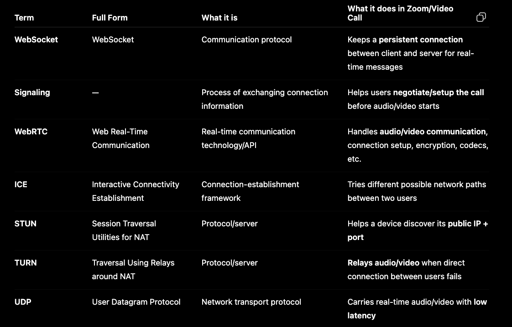
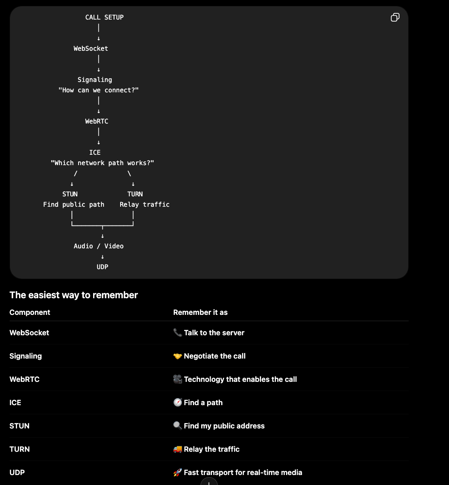

## WebSocket is used for signaling, WebRTC handles real-time communication, ICE finds a network path, STUN discovers the public endpoint, TURN relays traffic when direct connectivity fails, and UDP is commonly used to transport the real-time audio/video.