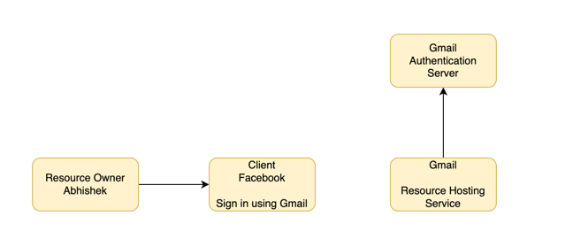
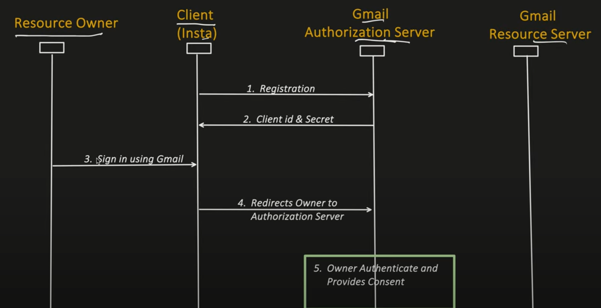
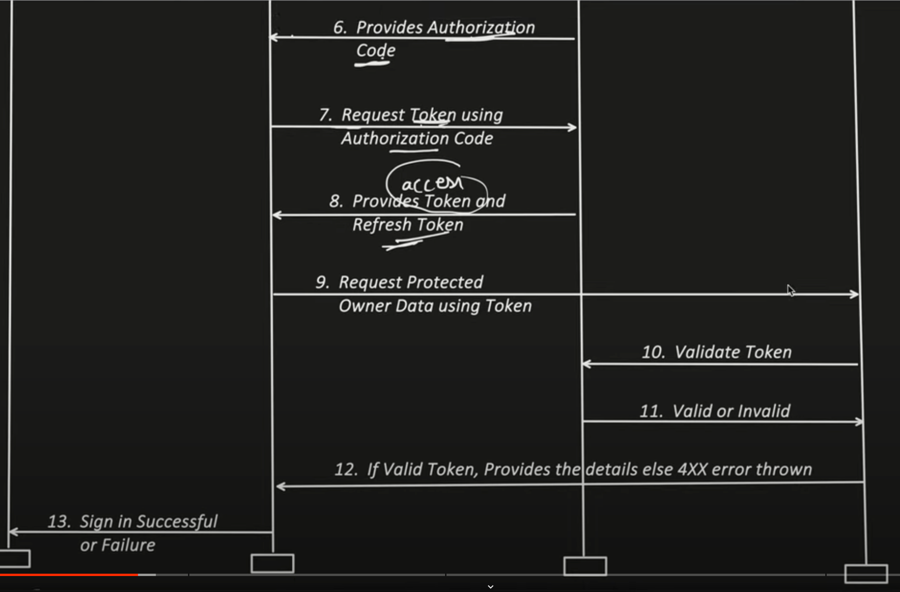

# OAuth2.0

Authentication : Check user identity
Authorization : Check scope
SSO : Authenticate once and access multiple applications

Actors

1) Resource Owner
2) Client
3) Authorization Server
4) Resource Hosting Server

Authorization Grant Types
1) Authorization Code Grant ***
2) Implicit Grant
3) Resource Owner Password Credentials Grant
4) Client Credential Grant
5) Refresh Token Grant ***

