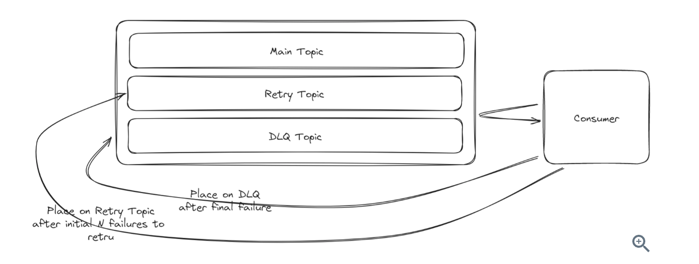

#What will happen if kafka broker goes down

-> If kafka broker goes down, the partition replicas/followers in another broker will act as leader.
-> Replication Factor 

On good hardware single broker can store around 1TB of data, 10000 messages

#Scalability - 
More Partitions and more brokers

Hot Partitions - Use Compound Keys
                - No partition Key
                - Random Number or timestamp

#Kafka Consumer goes down -
1) Offset Management - Once Consumer is up start reading from the Offset that it stopped
2) Rebalancing - If one consumer goes down in consumer group. Redistribute the partitions in the available consumers in the consumer group


#Retries

1) Producers : Kafka producer supports automatic retries. We can configure them

2) Consumer Retries : There is no direct way but we could handle this logic.



#Performance

1) Batch Messages
   ```
      When Kafka sends messages in batches, it means that instead of sending each message individually over the network, it groups multiple messages together into a single batch.   
    ```

2) Compression - Avro

```
Properties props = new Properties();
props.put("bootstrap.servers", "localhost:9092");
props.put("key.serializer", "io.confluent.kafka.serializers.KafkaAvroSerializer");
props.put("value.serializer", "io.confluent.kafka.serializers.KafkaAvroSerializer");
props.put("schema.registry.url", "http://localhost:8081");
props.put("compression.type", "snappy");

KafkaProducer<String, GenericRecord> producer = new KafkaProducer<>(props);

```

#Retention Policies

1) Default 7 days and 1GB whichever comes first

