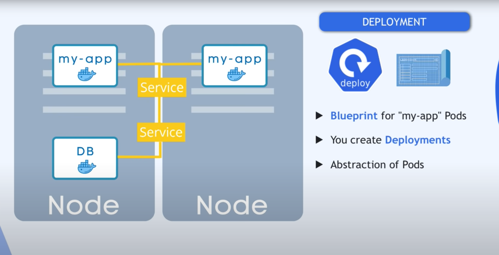

Kubernetes is open source container orchestration

Kube Api Server - It serves to scale the deployment of more instances.
Kube Scheduler - It assigns nodes to newly created pods
Kube Controller manager - It is a daemon that is used for embedding core control loops
                        - It is the process of overseeing and controlling the kubernetes clusters.    

Etcd - It is distributed key-value store for all of its data

Deployment is useful for managing stateless applications, while stateful set is userful for managing stateful applications that require stable network identities and persistent storage(Like DB).

While Service acts as the gateway for the communication and load balancing, Deployment orchestrates the management and scaling of your application's replicas.

NodePort - Open a specific port on all the nodes and forwards any traffic sent to this port to the service.

Ingress - Allows the users to access your kubernetes services from outside the kubernetes cluster