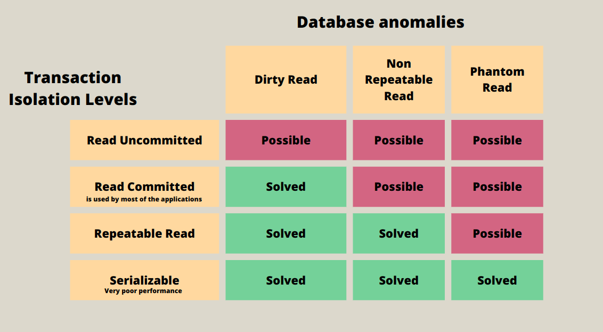
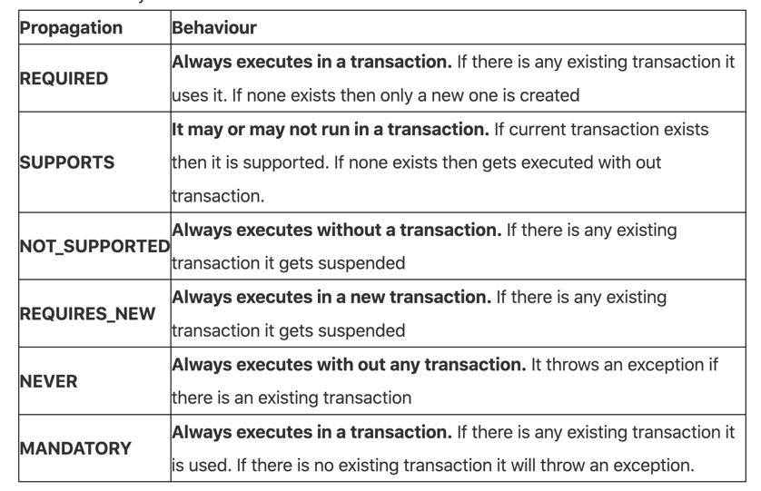
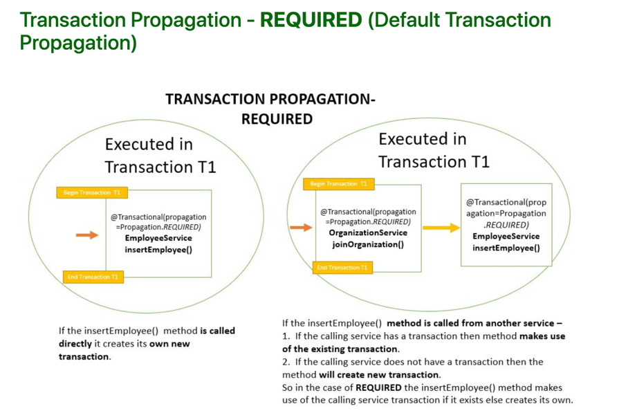
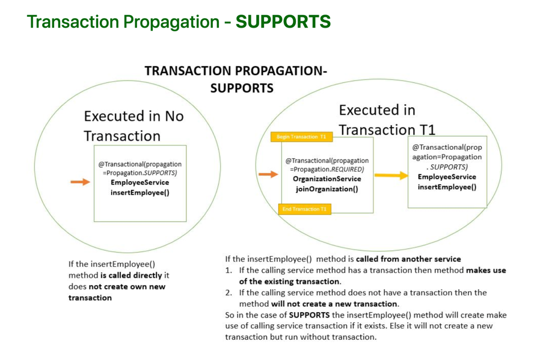
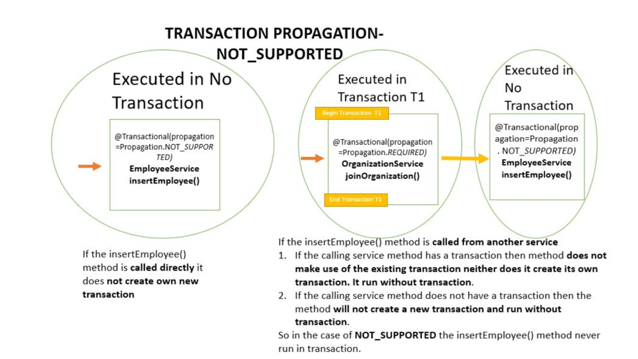
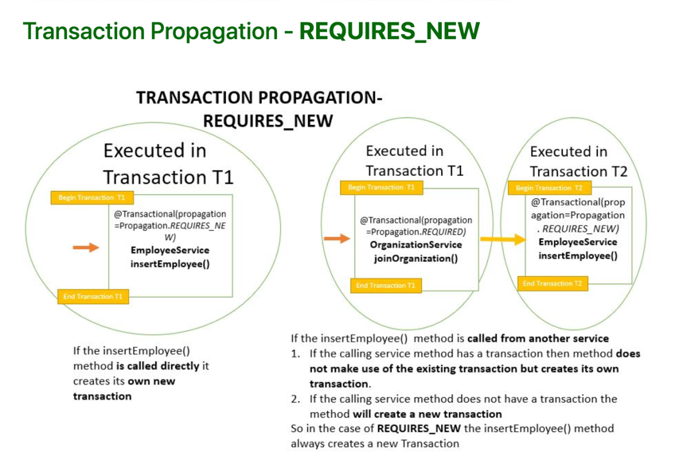
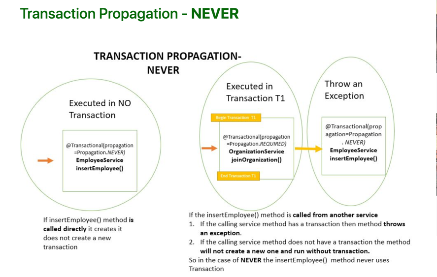
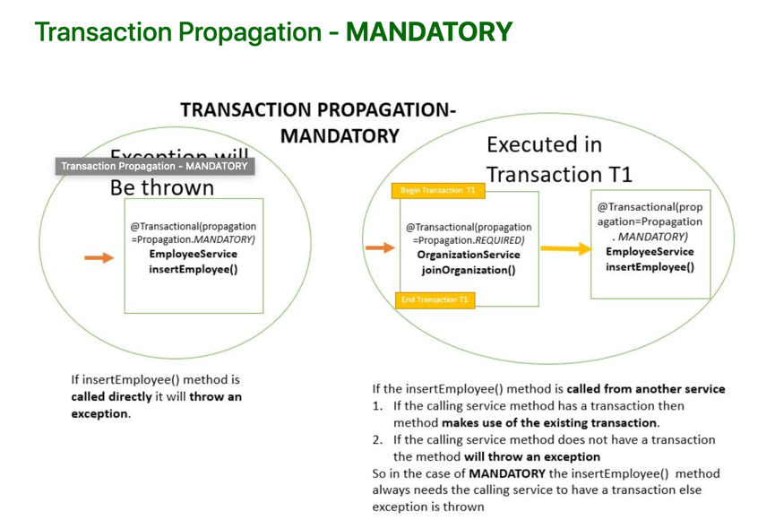

# DIRTY READ

Another transaction reads the modified value before a given transaction is committed.

# NON-REPEATABLE READ

When I’m reading the same value twice during the transaction, I get different values because some of the transaction has updated that value. This problem is called up non-repeatable. Will read when I’m trying to read the same thing twice, I’m getting two different values. It’s not repeatable.

# PHANTOM READ

At different times. I’m getting a different number of rows in the same transaction in transaction one.

@Transactional(isolation = Isolation.READ_UNCOMMITTED)
@Transactional(isolation = Isolation.READ_COMMITTED)
@Transactional(isolation = Isolation.REPEATABLE_READ)
@Transactional(isolation = Isolation.SERIALIZABLE)

@Transactional(propagation=Propagation.SUPPORTS)

