https://www.youtube.com/watch?v=IsgRatCefVc

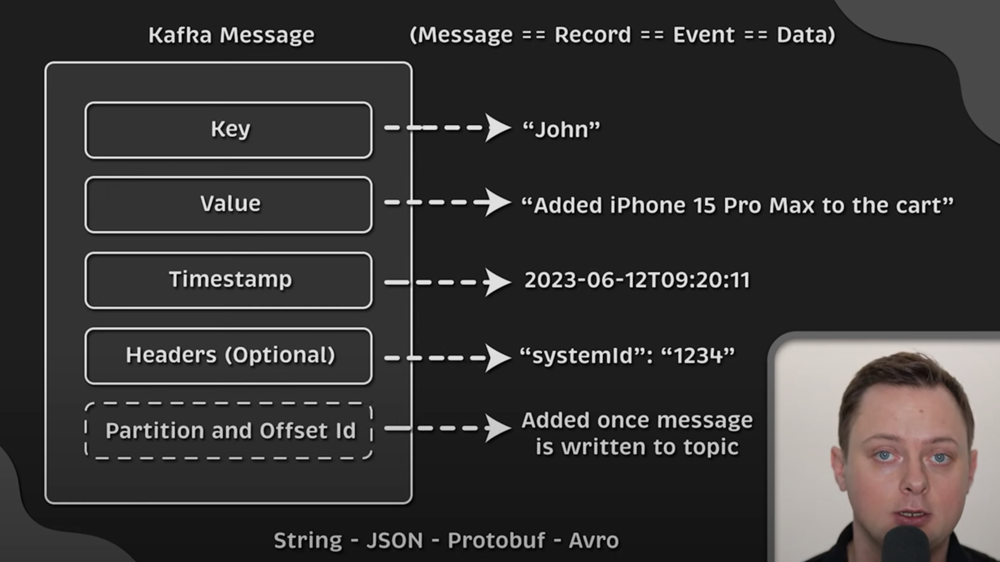 

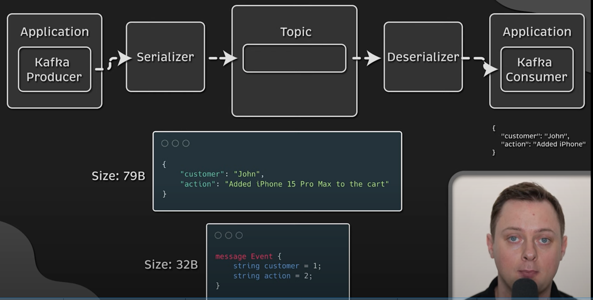

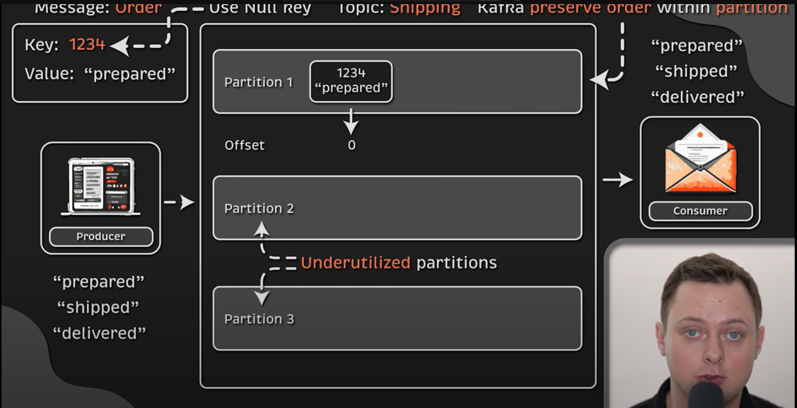

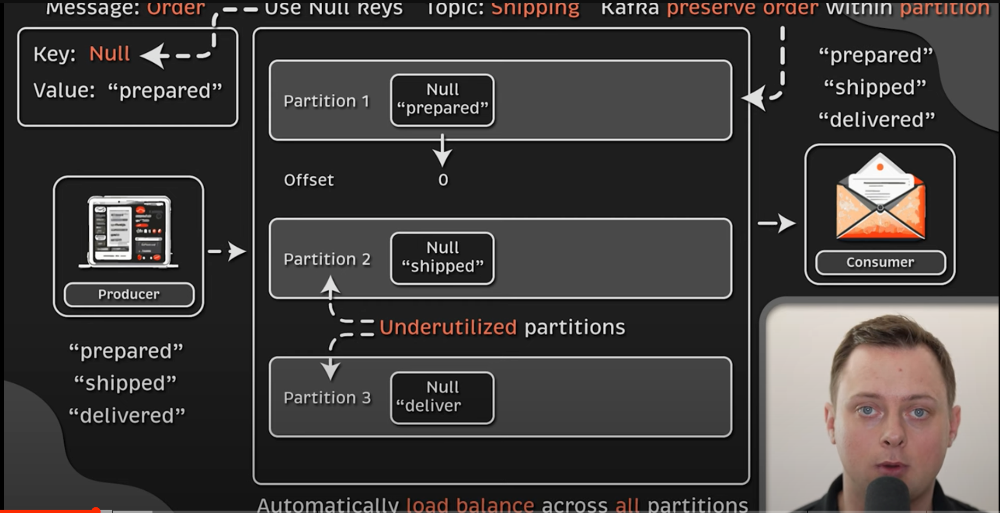

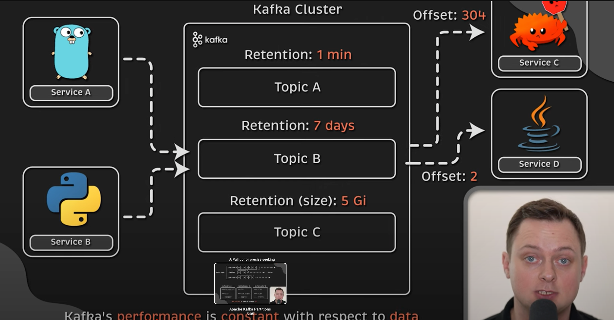

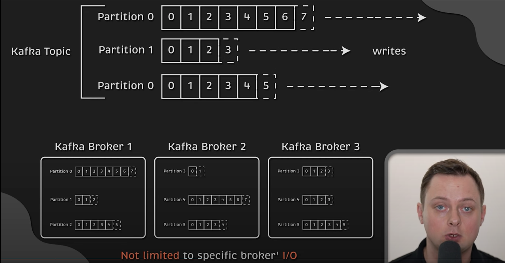

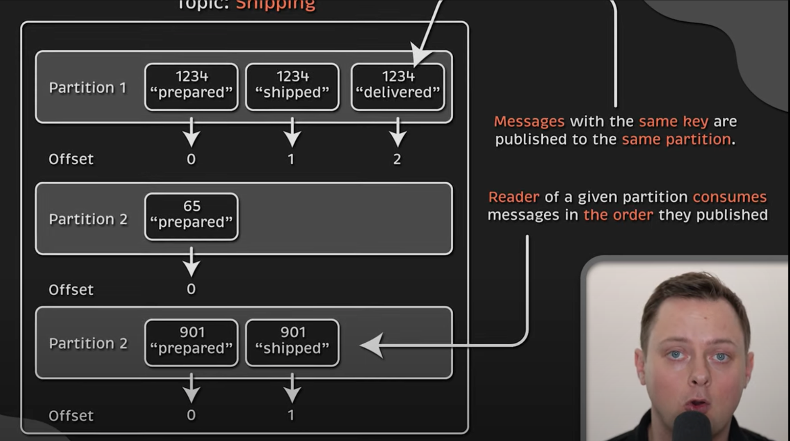

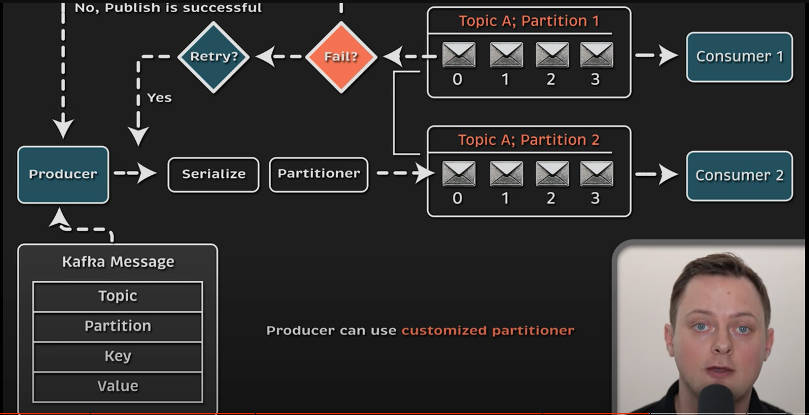

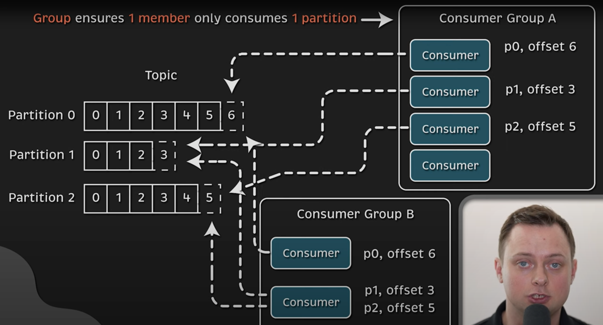

#Dead Letter Queue
1) Retry
2) Analysis and Debugging
3) Configuration and Monitoring

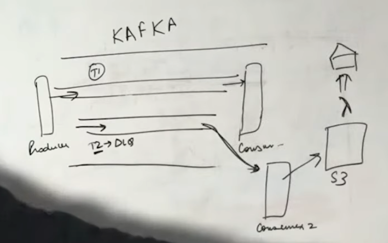

1) Producer produces a message via Topic T1 to Consumer
2) Message contained some error
3) Consumer will push the message to Topic T2(DLQ)
4) Consumer2 would be processing only the DLQ T2 Topic
5) Consumer2 would be pushing the message to S3
6) Lambda can be running on top of the S3 and sending out mail or alerts.

#Acknowledgments

acks = 0 - Producer will not wait for ack
acks = 1 - Producer will wait for ack that data is written to the leader partition
acks = all - Producer will with for ack that data is written to all the replica partition

#Idempotent Producers

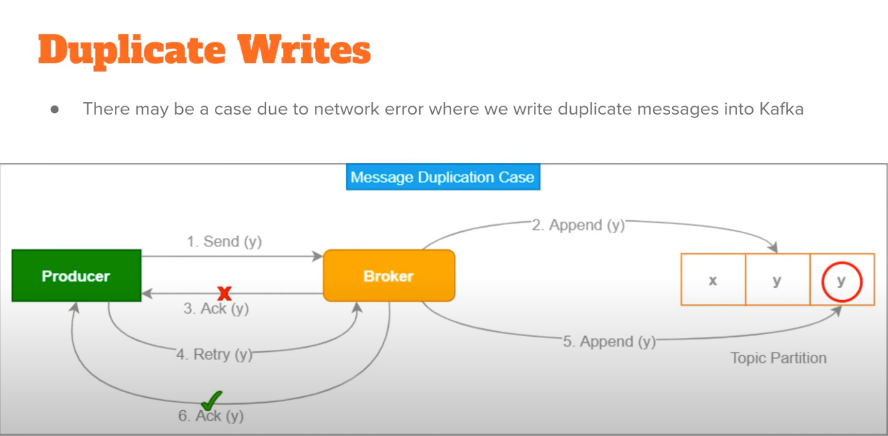

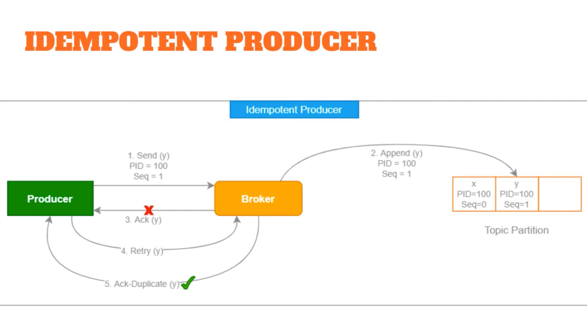

Set one of the producer properties - enable.idempotence = true (idempotent)

