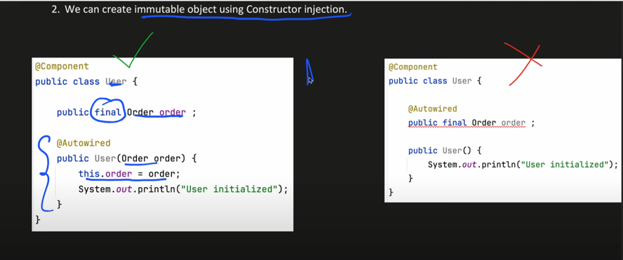

## SPRING

1) Inversion Of Control

- Inversion of Control is the principle in software engineering by which we transfer the control of objects of program to a container or framework.

2) Dependency Injection

- Dependency injection is a pattern that implements inversion of control for resolving dependencies
- DI is a process whereby objects define their dependencies and container injects those dependencies by creating the bean. This process is known as IOC.
- Spring container is responsible for instantiating, configuring and assembling the objects known as Beans as well as managing their lifecyle.
- Dependency injection can be performed in three ways :
a) Constructor Based Dependency Injection
b) Setter Based Dependency Injection
c) Field Based Dependency Injection
  



  
Advantages of Dependency Injection
1) Loosely Coupled
2) High Cohesion

DisAdvantages 
1) Complexity

- Cohesion - Cohesion refers to the degree to which elements of a module/class belong together, it's suggested that the related code should be close to each other.
- Coupling - Coupling refers to the degree to which the different modules/classes depend on each other.

3) Beans

- Beans are objects that are assembled, instantiated and managed by a spring IOC container.

Five Scopes :
- Singleton - One Instance of bean will be created for each container
- Prototype - A new Instance will be created everytime bean is requested
- Request - A new instance will be created for each HTTP request
- Session - A new instance will be created for each HTTP session by the container
- Global Session - This is used to created global session beans for the portlet applications.


  
Exception Handling in Spring
1) @ExceptionHandler
2) @ControllerAdvice

Annotations 

- TODO

How to Create Bean
- @Component
- @Configuration

````
@PathVaiable

@GetMapping("/foos/{id}")

@RequestParam

@GetMapping("/api/foos")

@RequestParam String id

````

Bean 
- Eager
- Lazy


## AOP

AOP is used to increase the modularity by cross cutting concerns

- A cross cutting concern is a concern that can affect the whole application and should be centralized in one 
location in code as possible such as authentication, logging, security etc.
  
Join Point 

- Join Point is any point in your program such as method execution, exception handling, field access etc.
Spring supports only method execution join point.
  
Point Cut

- It is an expression language of AOP that matches join point

Advice 

- Advice represent action taken by an aspect at a particular join point

Types
  - Before Advice
  - After returning advice
  - After throwing advice
  - After finally advice
  - Around Advice - Executes before and after join point

Aspect

_ It is a class that contains advices, join points etc.


